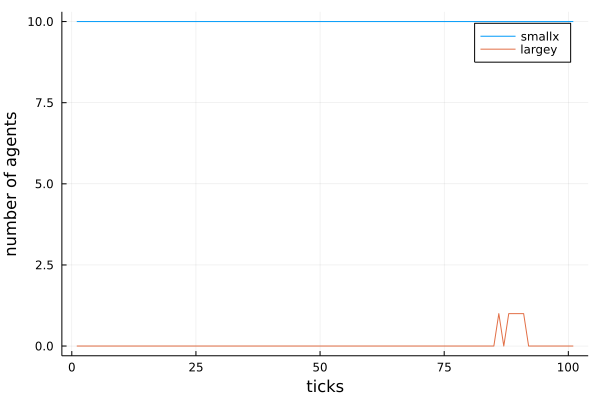

```julia
using Pkg, Revise
Pkg.activate(joinpath(@__DIR__, ".."))
using Abmot
```

      Activating project at `~/.julia/dev/Abmot`


<div style="padding: 1em; background-color: #f8d6da; border: 1px solid #f5c6cb; font-weight: bold;">
<p>The WebIO Jupyter extension was not detected. See the
<a href="https://juliagizmos.github.io/WebIO.jl/latest/providers/ijulia/" target="_blank">
    WebIO Jupyter integration documentation
</a>
for more information.
</div>


# 2D Models in SimpleABM Example1

## Step 1: Create Agents and Model
Lets create 10 agents with properties color, shape and pos (default property), and then create a 2D model with these agents. 


```julia
agents = create_2d_agents(10, color = :red, shape= :circle)
model = create_2d_model(agents, grid_size = (30,30), random_positions = true, periodic = true)
```


    SimpleABM GridModel{MortalType}: In a MortalType model agents can take birth or die.


## Step 2: Initialise the model
In the above code all agents were initialised with same color and shape. If we want to set different properties for our agents before starting the simulation, we can do so by defining an initialiser function and passing it as an argument to the init_model! function.


```julia
function initialiser!(model)
    for (i,agent) in enumerate(model.agents)
        if i<4
            agent.color = :red
            agent.shape = :box
        elseif i<7
            agent.color = :white
            agent.shape = :star
        else
            agent.color = :yellow
            agent.shape = :arrow
        end
    end
end

init_model!(model, initialiser = initialiser!)
```

## Step 3: Run the model
In order to run the model we need to define an agent_step_function and/or a model_step_function which define the actions that agents do at each step, and then pass these functions as arguments to the run_model! function. Here we define only agent_step_function and then run the model for 100 steps. The aprop argument specifies the agent properties that need to be recorded during simulation.


```julia
function agent_step_function!(agent, model)
    agent.pos +=(0.1-0.2*rand(), 0.1-0.2*rand())
end
run_model!(model, steps=100, agent_step_function = agent_step_function!, aprops = [:pos])
```


    1


## Step 4: Animation and Data


```julia
animate_sim(model, 100)
```


<div
    class="webio-mountpoint"
    data-webio-mountpoint="2490000629095083294"
>
    <script>
    (function(){
    // Some integrations (namely, IJulia/Jupyter) use an alternate render pathway than
    // just putting the html on the page. If WebIO isn't defined, then it's pretty likely
    // that we're in one of those situations and the integration just isn't installed
    // correctly.
    if (typeof window.WebIO === "undefined") {
        document
            .querySelector('[data-webio-mountpoint="2490000629095083294"]')
            .innerHTML = (
                '<div style="padding: 1em; background-color: #f8d6da; border: 1px solid #f5c6cb; font-weight: bold;">' +
                '<p><strong>WebIO not detected.</strong></p>' +
                '<p>Please read ' +
                '<a href="https://juliagizmos.github.io/WebIO.jl/latest/troubleshooting/not-detected/" target="_blank">the troubleshooting guide</a> ' +
                'for more information on how to resolve this issue.</p>' +
                '<p><a href="https://juliagizmos.github.io/WebIO.jl/latest/troubleshooting/not-detected/" target="_blank">https://juliagizmos.github.io/WebIO.jl/latest/troubleshooting/not-detected/</a></p>' +
                '</div>'
            );
        return;
    }
    WebIO.mount(
        document.querySelector('[data-webio-mountpoint="2490000629095083294"]'),
        {"props":{"style":{"display":"flex","flex-direction":"column"}},"nodeType":"DOM","type":"node","instanceArgs":{"namespace":"html","tag":"div"},"children":[{"props":{"style":{"display":"flex","flex-direction":"row"}},"nodeType":"DOM","type":"node","instanceArgs":{"namespace":"html","tag":"div"},"children":[{"props":{"style":{"display":"flex","flex-direction":"column"}},"nodeType":"DOM","type":"node","instanceArgs":{"namespace":"html","tag":"div"},"children":[{"props":{"className":"field interact-widget"},"nodeType":"DOM","type":"node","instanceArgs":{"namespace":"html","tag":"div"},"children":[{"props":{},"nodeType":"Scope","type":"node","instanceArgs":{"imports":{"data":[{"name":"knockout","type":"js","url":"\/assetserver\/c1499ba55a1bc421a61388a1d89a415fc6dcc13c-knockout.js"},{"name":"knockout_punches","type":"js","url":"\/assetserver\/f9c6b7aff92992a2d2baddb2c82a79fb8b3956c2-knockout_punches.js"},{"name":null,"type":"js","url":"\/assetserver\/d98610aa326aee8a709cc7d91aea3aadf7cb1517-all.js"},{"name":null,"type":"css","url":"\/assetserver\/457be80a26ff437349c55b6aa8871c7065926fae-style.css"},{"name":null,"type":"css","url":"\/assetserver\/3cd1ef316d208db1ffc36b6f265c6ac56f9847a0-bulma_confined.min.css"}],"type":"async_block"},"id":"847652453325134971","handlers":{"changes":["(function (val){return (val!=this.model[\"changes\"]()) ? (this.valueFromJulia[\"changes\"]=true, this.model[\"changes\"](val)) : undefined})"],"index":["(function (val){return (val!=this.model[\"index\"]()) ? (this.valueFromJulia[\"index\"]=true, this.model[\"index\"](val)) : undefined})"]},"systemjs_options":null,"mount_callbacks":["function () {\n    var handler = (function (ko, koPunches) {\n    ko.punches.enableAll();\n    ko.bindingHandlers.numericValue = {\n        init: function(element, valueAccessor, allBindings, data, context) {\n            var stringified = ko.observable(ko.unwrap(valueAccessor()));\n            stringified.subscribe(function(value) {\n                var val = parseFloat(value);\n                if (!isNaN(val)) {\n                    valueAccessor()(val);\n                }\n            });\n            valueAccessor().subscribe(function(value) {\n                var str = JSON.stringify(value);\n                if ((str == \"0\") && ([\"-0\", \"-0.\"].indexOf(stringified()) >= 0))\n                     return;\n                 if ([\"null\", \"\"].indexOf(str) >= 0)\n                     return;\n                stringified(str);\n            });\n            ko.applyBindingsToNode(\n                element,\n                {\n                    value: stringified,\n                    valueUpdate: allBindings.get('valueUpdate'),\n                },\n                context,\n            );\n        }\n    };\n    var json_data = {\"formatted_vals\":[\"1\",\"2\",\"3\",\"4\",\"5\",\"6\",\"7\",\"8\",\"9\",\"10\",\"11\",\"12\",\"13\",\"14\",\"15\",\"16\",\"17\",\"18\",\"19\",\"20\",\"21\",\"22\",\"23\",\"24\",\"25\",\"26\",\"27\",\"28\",\"29\",\"30\",\"31\",\"32\",\"33\",\"34\",\"35\",\"36\",\"37\",\"38\",\"39\",\"40\",\"41\",\"42\",\"43\",\"44\",\"45\",\"46\",\"47\",\"48\",\"49\",\"50\",\"51\",\"52\",\"53\",\"54\",\"55\",\"56\",\"57\",\"58\",\"59\",\"60\",\"61\",\"62\",\"63\",\"64\",\"65\",\"66\",\"67\",\"68\",\"69\",\"70\",\"71\",\"72\",\"73\",\"74\",\"75\",\"76\",\"77\",\"78\",\"79\",\"80\",\"81\",\"82\",\"83\",\"84\",\"85\",\"86\",\"87\",\"88\",\"89\",\"90\",\"91\",\"92\",\"93\",\"94\",\"95\",\"96\",\"97\",\"98\",\"99\",\"100\"],\"changes\":WebIO.getval({\"name\":\"changes\",\"scope\":\"847652453325134971\",\"id\":\"12701994039995219765\",\"type\":\"observable\"}),\"index\":WebIO.getval({\"name\":\"index\",\"scope\":\"847652453325134971\",\"id\":\"12319686109455894670\",\"type\":\"observable\"})};\n    var self = this;\n    function AppViewModel() {\n        for (var key in json_data) {\n            var el = json_data[key];\n            this[key] = Array.isArray(el) ? ko.observableArray(el) : ko.observable(el);\n        }\n        \n        [this[\"formatted_val\"]=ko.computed(    function(){\n        return this.formatted_vals()[parseInt(this.index())-(1)];\n    }\n,this)]\n        [this[\"changes\"].subscribe((function (val){!(this.valueFromJulia[\"changes\"]) ? (WebIO.setval({\"name\":\"changes\",\"scope\":\"847652453325134971\",\"id\":\"12701994039995219765\",\"type\":\"observable\"},val)) : undefined; return this.valueFromJulia[\"changes\"]=false}),self),this[\"index\"].subscribe((function (val){!(this.valueFromJulia[\"index\"]) ? (WebIO.setval({\"name\":\"index\",\"scope\":\"847652453325134971\",\"id\":\"12319686109455894670\",\"type\":\"observable\"},val)) : undefined; return this.valueFromJulia[\"index\"]=false}),self)]\n        \n    }\n    self.model = new AppViewModel();\n    self.valueFromJulia = {};\n    for (var key in json_data) {\n        self.valueFromJulia[key] = false;\n    }\n    ko.applyBindings(self.model, self.dom);\n}\n);\n    (WebIO.importBlock({\"data\":[{\"name\":\"knockout\",\"type\":\"js\",\"url\":\"\/assetserver\/c1499ba55a1bc421a61388a1d89a415fc6dcc13c-knockout.js\"},{\"name\":\"knockout_punches\",\"type\":\"js\",\"url\":\"\/assetserver\/f9c6b7aff92992a2d2baddb2c82a79fb8b3956c2-knockout_punches.js\"}],\"type\":\"async_block\"})).then((imports) => handler.apply(this, imports));\n}\n"],"observables":{"changes":{"sync":false,"id":"12701994039995219765","value":0},"index":{"sync":true,"id":"12319686109455894670","value":50}}},"children":[{"props":{"className":"interact-flex-row interact-widget"},"nodeType":"DOM","type":"node","instanceArgs":{"namespace":"html","tag":"div"},"children":[{"props":{"className":"interact-flex-row-left"},"nodeType":"DOM","type":"node","instanceArgs":{"namespace":"html","tag":"div"},"children":[{"props":{"className":"interact ","style":{"padding":"5px 10px 0px 10px"}},"nodeType":"DOM","type":"node","instanceArgs":{"namespace":"html","tag":"label"},"children":["time"]}]},{"props":{"className":"interact-flex-row-center"},"nodeType":"DOM","type":"node","instanceArgs":{"namespace":"html","tag":"div"},"children":[{"props":{"max":100,"min":1,"attributes":{"type":"range","data-bind":"numericValue: index, valueUpdate: 'input', event: {change: function (){this.changes(this.changes()+1)}}","orient":"horizontal"},"step":1,"className":"slider slider is-fullwidth","style":{}},"nodeType":"DOM","type":"node","instanceArgs":{"namespace":"html","tag":"input"},"children":[]}]},{"props":{"className":"interact-flex-row-right"},"nodeType":"DOM","type":"node","instanceArgs":{"namespace":"html","tag":"div"},"children":[{"props":{"attributes":{"data-bind":"text: formatted_val"}},"nodeType":"DOM","type":"node","instanceArgs":{"namespace":"html","tag":"p"},"children":[]}]}]}]}]},{"props":{"className":"field interact-widget"},"nodeType":"DOM","type":"node","instanceArgs":{"namespace":"html","tag":"div"},"children":[{"props":{},"nodeType":"Scope","type":"node","instanceArgs":{"imports":{"data":[{"name":"knockout","type":"js","url":"\/assetserver\/c1499ba55a1bc421a61388a1d89a415fc6dcc13c-knockout.js"},{"name":"knockout_punches","type":"js","url":"\/assetserver\/f9c6b7aff92992a2d2baddb2c82a79fb8b3956c2-knockout_punches.js"},{"name":null,"type":"js","url":"\/assetserver\/d98610aa326aee8a709cc7d91aea3aadf7cb1517-all.js"},{"name":null,"type":"css","url":"\/assetserver\/457be80a26ff437349c55b6aa8871c7065926fae-style.css"},{"name":null,"type":"css","url":"\/assetserver\/3cd1ef316d208db1ffc36b6f265c6ac56f9847a0-bulma_confined.min.css"}],"type":"async_block"},"id":"17338989843587842490","handlers":{"changes":["(function (val){return (val!=this.model[\"changes\"]()) ? (this.valueFromJulia[\"changes\"]=true, this.model[\"changes\"](val)) : undefined})"],"index":["(function (val){return (val!=this.model[\"index\"]()) ? (this.valueFromJulia[\"index\"]=true, this.model[\"index\"](val)) : undefined})"]},"systemjs_options":null,"mount_callbacks":["function () {\n    var handler = (function (ko, koPunches) {\n    ko.punches.enableAll();\n    ko.bindingHandlers.numericValue = {\n        init: function(element, valueAccessor, allBindings, data, context) {\n            var stringified = ko.observable(ko.unwrap(valueAccessor()));\n            stringified.subscribe(function(value) {\n                var val = parseFloat(value);\n                if (!isNaN(val)) {\n                    valueAccessor()(val);\n                }\n            });\n            valueAccessor().subscribe(function(value) {\n                var str = JSON.stringify(value);\n                if ((str == \"0\") && ([\"-0\", \"-0.\"].indexOf(stringified()) >= 0))\n                     return;\n                 if ([\"null\", \"\"].indexOf(str) >= 0)\n                     return;\n                stringified(str);\n            });\n            ko.applyBindingsToNode(\n                element,\n                {\n                    value: stringified,\n                    valueUpdate: allBindings.get('valueUpdate'),\n                },\n                context,\n            );\n        }\n    };\n    var json_data = {\"formatted_vals\":[\"0.1\",\"0.2\",\"0.3\",\"0.4\",\"0.5\",\"0.6\",\"0.7\",\"0.8\",\"0.9\",\"1.0\",\"1.1\",\"1.2\",\"1.3\",\"1.4\",\"1.5\",\"1.6\",\"1.7\",\"1.8\",\"1.9\",\"2.0\",\"2.1\",\"2.2\",\"2.3\",\"2.4\",\"2.5\",\"2.6\",\"2.7\",\"2.8\",\"2.9\",\"3.0\",\"3.1\",\"3.2\",\"3.3\",\"3.4\",\"3.5\",\"3.6\",\"3.7\",\"3.8\",\"3.9\",\"4.0\",\"4.1\",\"4.2\",\"4.3\",\"4.4\",\"4.5\",\"4.6\",\"4.7\",\"4.8\",\"4.9\",\"5.0\"],\"changes\":WebIO.getval({\"name\":\"changes\",\"scope\":\"17338989843587842490\",\"id\":\"15719930849471424300\",\"type\":\"observable\"}),\"index\":WebIO.getval({\"name\":\"index\",\"scope\":\"17338989843587842490\",\"id\":\"10573588534987971549\",\"type\":\"observable\"})};\n    var self = this;\n    function AppViewModel() {\n        for (var key in json_data) {\n            var el = json_data[key];\n            this[key] = Array.isArray(el) ? ko.observableArray(el) : ko.observable(el);\n        }\n        \n        [this[\"formatted_val\"]=ko.computed(    function(){\n        return this.formatted_vals()[parseInt(this.index())-(1)];\n    }\n,this)]\n        [this[\"changes\"].subscribe((function (val){!(this.valueFromJulia[\"changes\"]) ? (WebIO.setval({\"name\":\"changes\",\"scope\":\"17338989843587842490\",\"id\":\"15719930849471424300\",\"type\":\"observable\"},val)) : undefined; return this.valueFromJulia[\"changes\"]=false}),self),this[\"index\"].subscribe((function (val){!(this.valueFromJulia[\"index\"]) ? (WebIO.setval({\"name\":\"index\",\"scope\":\"17338989843587842490\",\"id\":\"10573588534987971549\",\"type\":\"observable\"},val)) : undefined; return this.valueFromJulia[\"index\"]=false}),self)]\n        \n    }\n    self.model = new AppViewModel();\n    self.valueFromJulia = {};\n    for (var key in json_data) {\n        self.valueFromJulia[key] = false;\n    }\n    ko.applyBindings(self.model, self.dom);\n}\n);\n    (WebIO.importBlock({\"data\":[{\"name\":\"knockout\",\"type\":\"js\",\"url\":\"\/assetserver\/c1499ba55a1bc421a61388a1d89a415fc6dcc13c-knockout.js\"},{\"name\":\"knockout_punches\",\"type\":\"js\",\"url\":\"\/assetserver\/f9c6b7aff92992a2d2baddb2c82a79fb8b3956c2-knockout_punches.js\"}],\"type\":\"async_block\"})).then((imports) => handler.apply(this, imports));\n}\n"],"observables":{"changes":{"sync":false,"id":"15719930849471424300","value":0},"index":{"sync":true,"id":"10573588534987971549","value":25}}},"children":[{"props":{"className":"interact-flex-row interact-widget"},"nodeType":"DOM","type":"node","instanceArgs":{"namespace":"html","tag":"div"},"children":[{"props":{"className":"interact-flex-row-left"},"nodeType":"DOM","type":"node","instanceArgs":{"namespace":"html","tag":"div"},"children":[{"props":{"className":"interact ","style":{"padding":"5px 10px 0px 10px"}},"nodeType":"DOM","type":"node","instanceArgs":{"namespace":"html","tag":"label"},"children":["scale"]}]},{"props":{"className":"interact-flex-row-center"},"nodeType":"DOM","type":"node","instanceArgs":{"namespace":"html","tag":"div"},"children":[{"props":{"max":50,"min":1,"attributes":{"type":"range","data-bind":"numericValue: index, valueUpdate: 'input', event: {change: function (){this.changes(this.changes()+1)}}","orient":"horizontal"},"step":1,"className":"slider slider is-fullwidth","style":{}},"nodeType":"DOM","type":"node","instanceArgs":{"namespace":"html","tag":"input"},"children":[]}]},{"props":{"className":"interact-flex-row-right"},"nodeType":"DOM","type":"node","instanceArgs":{"namespace":"html","tag":"div"},"children":[{"props":{"attributes":{"data-bind":"text: formatted_val"}},"nodeType":"DOM","type":"node","instanceArgs":{"namespace":"html","tag":"p"},"children":[]}]}]}]}]},{"props":{"style":{"display":"flex","flex-direction":"row"}},"nodeType":"DOM","type":"node","instanceArgs":{"namespace":"html","tag":"div"},"children":[{"props":{"className":"interact-widget"},"nodeType":"DOM","type":"node","instanceArgs":{"namespace":"html","tag":"div"},"children":[{"props":{},"nodeType":"Scope","type":"node","instanceArgs":{"imports":{"data":[{"name":null,"type":"js","url":"\/assetserver\/19a5359bdf5fe26635c6a9c98bbe8dc477c9d18e-katex.min.js"},{"name":null,"type":"css","url":"\/assetserver\/510a04dfddb84bc394dc07fffef4a63cac393c2d-katex.min.css"}],"type":"async_block"},"id":"3622588495608135705","handlers":{"value":["(function (txt){return this.k.render(txt,this.container)})"]},"systemjs_options":null,"mount_callbacks":["function () {\n    var handler = ((function (k){this.k=k; this.container=this.dom.querySelector(\"#container\"); return k.render(\"\\\\;\\\\;\",this.container)}));\n    (WebIO.importBlock({\"data\":[{\"name\":null,\"type\":\"js\",\"url\":\"\/assetserver\/19a5359bdf5fe26635c6a9c98bbe8dc477c9d18e-katex.min.js\"},{\"name\":null,\"type\":\"css\",\"url\":\"\/assetserver\/510a04dfddb84bc394dc07fffef4a63cac393c2d-katex.min.css\"}],\"type\":\"async_block\"})).then((imports) => handler.apply(this, imports));\n}\n"],"observables":{"value":{"sync":false,"id":"6306495159052837774","value":"\\;\\;"}}},"children":[{"props":{"id":"container"},"nodeType":"DOM","type":"node","instanceArgs":{"namespace":"html","tag":"div"},"children":[]}]}]},{"props":{"className":"field interact-widget"},"nodeType":"DOM","type":"node","instanceArgs":{"namespace":"html","tag":"div"},"children":[{"props":{},"nodeType":"Scope","type":"node","instanceArgs":{"imports":{"data":[{"name":"knockout","type":"js","url":"\/assetserver\/c1499ba55a1bc421a61388a1d89a415fc6dcc13c-knockout.js"},{"name":"knockout_punches","type":"js","url":"\/assetserver\/f9c6b7aff92992a2d2baddb2c82a79fb8b3956c2-knockout_punches.js"},{"name":null,"type":"js","url":"\/assetserver\/d98610aa326aee8a709cc7d91aea3aadf7cb1517-all.js"},{"name":null,"type":"css","url":"\/assetserver\/457be80a26ff437349c55b6aa8871c7065926fae-style.css"},{"name":null,"type":"css","url":"\/assetserver\/3cd1ef316d208db1ffc36b6f265c6ac56f9847a0-bulma_confined.min.css"}],"type":"async_block"},"id":"11419608400292956629","handlers":{"loading":["(function (val){return (val!=this.model[\"loading\"]()) ? (this.valueFromJulia[\"loading\"]=true, this.model[\"loading\"](val)) : undefined})"],"clicks":["(function (val){return (val!=this.model[\"clicks\"]()) ? (this.valueFromJulia[\"clicks\"]=true, this.model[\"clicks\"](val)) : undefined})"]},"systemjs_options":null,"mount_callbacks":["function () {\n    var handler = (function (ko, koPunches) {\n    ko.punches.enableAll();\n    ko.bindingHandlers.numericValue = {\n        init: function(element, valueAccessor, allBindings, data, context) {\n            var stringified = ko.observable(ko.unwrap(valueAccessor()));\n            stringified.subscribe(function(value) {\n                var val = parseFloat(value);\n                if (!isNaN(val)) {\n                    valueAccessor()(val);\n                }\n            });\n            valueAccessor().subscribe(function(value) {\n                var str = JSON.stringify(value);\n                if ((str == \"0\") && ([\"-0\", \"-0.\"].indexOf(stringified()) >= 0))\n                     return;\n                 if ([\"null\", \"\"].indexOf(str) >= 0)\n                     return;\n                stringified(str);\n            });\n            ko.applyBindingsToNode(\n                element,\n                {\n                    value: stringified,\n                    valueUpdate: allBindings.get('valueUpdate'),\n                },\n                context,\n            );\n        }\n    };\n    var json_data = {\"loading\":WebIO.getval({\"name\":\"loading\",\"scope\":\"11419608400292956629\",\"id\":\"13928002449504271355\",\"type\":\"observable\"}),\"clicks\":WebIO.getval({\"name\":\"clicks\",\"scope\":\"11419608400292956629\",\"id\":\"17210956271047918941\",\"type\":\"observable\"})};\n    var self = this;\n    function AppViewModel() {\n        for (var key in json_data) {\n            var el = json_data[key];\n            this[key] = Array.isArray(el) ? ko.observableArray(el) : ko.observable(el);\n        }\n        \n        \n        [this[\"loading\"].subscribe((function (val){!(this.valueFromJulia[\"loading\"]) ? (WebIO.setval({\"name\":\"loading\",\"scope\":\"11419608400292956629\",\"id\":\"13928002449504271355\",\"type\":\"observable\"},val)) : undefined; return this.valueFromJulia[\"loading\"]=false}),self),this[\"clicks\"].subscribe((function (val){!(this.valueFromJulia[\"clicks\"]) ? (WebIO.setval({\"name\":\"clicks\",\"scope\":\"11419608400292956629\",\"id\":\"17210956271047918941\",\"type\":\"observable\"},val)) : undefined; return this.valueFromJulia[\"clicks\"]=false}),self)]\n        \n    }\n    self.model = new AppViewModel();\n    self.valueFromJulia = {};\n    for (var key in json_data) {\n        self.valueFromJulia[key] = false;\n    }\n    ko.applyBindings(self.model, self.dom);\n}\n);\n    (WebIO.importBlock({\"data\":[{\"name\":\"knockout\",\"type\":\"js\",\"url\":\"\/assetserver\/c1499ba55a1bc421a61388a1d89a415fc6dcc13c-knockout.js\"},{\"name\":\"knockout_punches\",\"type\":\"js\",\"url\":\"\/assetserver\/f9c6b7aff92992a2d2baddb2c82a79fb8b3956c2-knockout_punches.js\"}],\"type\":\"async_block\"})).then((imports) => handler.apply(this, imports));\n}\n"],"observables":{"loading":{"sync":false,"id":"13928002449504271355","value":false},"clicks":{"sync":true,"id":"17210956271047918941","value":0}}},"children":[{"props":{"attributes":{"data-bind":"click: function (){this.clicks(this.clicks()+1)}, css: {'is-loading' : loading}"},"className":"is-medium button is-primary","style":{}},"nodeType":"DOM","type":"node","instanceArgs":{"namespace":"html","tag":"button"},"children":["run"]}]}]},{"props":{"className":"interact-widget"},"nodeType":"DOM","type":"node","instanceArgs":{"namespace":"html","tag":"div"},"children":[{"props":{},"nodeType":"Scope","type":"node","instanceArgs":{"imports":{"data":[{"name":null,"type":"js","url":"\/assetserver\/19a5359bdf5fe26635c6a9c98bbe8dc477c9d18e-katex.min.js"},{"name":null,"type":"css","url":"\/assetserver\/510a04dfddb84bc394dc07fffef4a63cac393c2d-katex.min.css"}],"type":"async_block"},"id":"3622588495608135705","handlers":{"value":["(function (txt){return this.k.render(txt,this.container)})"]},"systemjs_options":null,"mount_callbacks":["function () {\n    var handler = ((function (k){this.k=k; this.container=this.dom.querySelector(\"#container\"); return k.render(\"\\\\;\\\\;\",this.container)}));\n    (WebIO.importBlock({\"data\":[{\"name\":null,\"type\":\"js\",\"url\":\"\/assetserver\/19a5359bdf5fe26635c6a9c98bbe8dc477c9d18e-katex.min.js\"},{\"name\":null,\"type\":\"css\",\"url\":\"\/assetserver\/510a04dfddb84bc394dc07fffef4a63cac393c2d-katex.min.css\"}],\"type\":\"async_block\"})).then((imports) => handler.apply(this, imports));\n}\n"],"observables":{"value":{"sync":false,"id":"6306495159052837774","value":"\\;\\;"}}},"children":[{"props":{"id":"container"},"nodeType":"DOM","type":"node","instanceArgs":{"namespace":"html","tag":"div"},"children":[]}]}]},{"props":{"className":"field interact-widget"},"nodeType":"DOM","type":"node","instanceArgs":{"namespace":"html","tag":"div"},"children":[{"props":{},"nodeType":"Scope","type":"node","instanceArgs":{"imports":{"data":[{"name":"knockout","type":"js","url":"\/assetserver\/c1499ba55a1bc421a61388a1d89a415fc6dcc13c-knockout.js"},{"name":"knockout_punches","type":"js","url":"\/assetserver\/f9c6b7aff92992a2d2baddb2c82a79fb8b3956c2-knockout_punches.js"},{"name":null,"type":"js","url":"\/assetserver\/d98610aa326aee8a709cc7d91aea3aadf7cb1517-all.js"},{"name":null,"type":"css","url":"\/assetserver\/457be80a26ff437349c55b6aa8871c7065926fae-style.css"},{"name":null,"type":"css","url":"\/assetserver\/3cd1ef316d208db1ffc36b6f265c6ac56f9847a0-bulma_confined.min.css"}],"type":"async_block"},"id":"15844316131214707078","handlers":{"loading":["(function (val){return (val!=this.model[\"loading\"]()) ? (this.valueFromJulia[\"loading\"]=true, this.model[\"loading\"](val)) : undefined})"],"clicks":["(function (val){return (val!=this.model[\"clicks\"]()) ? (this.valueFromJulia[\"clicks\"]=true, this.model[\"clicks\"](val)) : undefined})"]},"systemjs_options":null,"mount_callbacks":["function () {\n    var handler = (function (ko, koPunches) {\n    ko.punches.enableAll();\n    ko.bindingHandlers.numericValue = {\n        init: function(element, valueAccessor, allBindings, data, context) {\n            var stringified = ko.observable(ko.unwrap(valueAccessor()));\n            stringified.subscribe(function(value) {\n                var val = parseFloat(value);\n                if (!isNaN(val)) {\n                    valueAccessor()(val);\n                }\n            });\n            valueAccessor().subscribe(function(value) {\n                var str = JSON.stringify(value);\n                if ((str == \"0\") && ([\"-0\", \"-0.\"].indexOf(stringified()) >= 0))\n                     return;\n                 if ([\"null\", \"\"].indexOf(str) >= 0)\n                     return;\n                stringified(str);\n            });\n            ko.applyBindingsToNode(\n                element,\n                {\n                    value: stringified,\n                    valueUpdate: allBindings.get('valueUpdate'),\n                },\n                context,\n            );\n        }\n    };\n    var json_data = {\"loading\":WebIO.getval({\"name\":\"loading\",\"scope\":\"15844316131214707078\",\"id\":\"4058522966224777552\",\"type\":\"observable\"}),\"clicks\":WebIO.getval({\"name\":\"clicks\",\"scope\":\"15844316131214707078\",\"id\":\"10320564720257874175\",\"type\":\"observable\"})};\n    var self = this;\n    function AppViewModel() {\n        for (var key in json_data) {\n            var el = json_data[key];\n            this[key] = Array.isArray(el) ? ko.observableArray(el) : ko.observable(el);\n        }\n        \n        \n        [this[\"loading\"].subscribe((function (val){!(this.valueFromJulia[\"loading\"]) ? (WebIO.setval({\"name\":\"loading\",\"scope\":\"15844316131214707078\",\"id\":\"4058522966224777552\",\"type\":\"observable\"},val)) : undefined; return this.valueFromJulia[\"loading\"]=false}),self),this[\"clicks\"].subscribe((function (val){!(this.valueFromJulia[\"clicks\"]) ? (WebIO.setval({\"name\":\"clicks\",\"scope\":\"15844316131214707078\",\"id\":\"10320564720257874175\",\"type\":\"observable\"},val)) : undefined; return this.valueFromJulia[\"clicks\"]=false}),self)]\n        \n    }\n    self.model = new AppViewModel();\n    self.valueFromJulia = {};\n    for (var key in json_data) {\n        self.valueFromJulia[key] = false;\n    }\n    ko.applyBindings(self.model, self.dom);\n}\n);\n    (WebIO.importBlock({\"data\":[{\"name\":\"knockout\",\"type\":\"js\",\"url\":\"\/assetserver\/c1499ba55a1bc421a61388a1d89a415fc6dcc13c-knockout.js\"},{\"name\":\"knockout_punches\",\"type\":\"js\",\"url\":\"\/assetserver\/f9c6b7aff92992a2d2baddb2c82a79fb8b3956c2-knockout_punches.js\"}],\"type\":\"async_block\"})).then((imports) => handler.apply(this, imports));\n}\n"],"observables":{"loading":{"sync":false,"id":"4058522966224777552","value":false},"clicks":{"sync":true,"id":"10320564720257874175","value":0}}},"children":[{"props":{"attributes":{"data-bind":"click: function (){this.clicks(this.clicks()+1)}, css: {'is-loading' : loading}"},"className":"is-medium button is-primary","style":{}},"nodeType":"DOM","type":"node","instanceArgs":{"namespace":"html","tag":"button"},"children":["stop"]}]}]},{"props":{"className":"interact-widget"},"nodeType":"DOM","type":"node","instanceArgs":{"namespace":"html","tag":"div"},"children":[{"props":{},"nodeType":"Scope","type":"node","instanceArgs":{"imports":{"data":[{"name":null,"type":"js","url":"\/assetserver\/19a5359bdf5fe26635c6a9c98bbe8dc477c9d18e-katex.min.js"},{"name":null,"type":"css","url":"\/assetserver\/510a04dfddb84bc394dc07fffef4a63cac393c2d-katex.min.css"}],"type":"async_block"},"id":"3622588495608135705","handlers":{"value":["(function (txt){return this.k.render(txt,this.container)})"]},"systemjs_options":null,"mount_callbacks":["function () {\n    var handler = ((function (k){this.k=k; this.container=this.dom.querySelector(\"#container\"); return k.render(\"\\\\;\\\\;\",this.container)}));\n    (WebIO.importBlock({\"data\":[{\"name\":null,\"type\":\"js\",\"url\":\"\/assetserver\/19a5359bdf5fe26635c6a9c98bbe8dc477c9d18e-katex.min.js\"},{\"name\":null,\"type\":\"css\",\"url\":\"\/assetserver\/510a04dfddb84bc394dc07fffef4a63cac393c2d-katex.min.css\"}],\"type\":\"async_block\"})).then((imports) => handler.apply(this, imports));\n}\n"],"observables":{"value":{"sync":false,"id":"6306495159052837774","value":"\\;\\;"}}},"children":[{"props":{"id":"container"},"nodeType":"DOM","type":"node","instanceArgs":{"namespace":"html","tag":"div"},"children":[]}]}]},{"props":{"className":"field interact-widget"},"nodeType":"DOM","type":"node","instanceArgs":{"namespace":"html","tag":"div"},"children":[{"props":{},"nodeType":"Scope","type":"node","instanceArgs":{"imports":{"data":[{"name":"knockout","type":"js","url":"\/assetserver\/c1499ba55a1bc421a61388a1d89a415fc6dcc13c-knockout.js"},{"name":"knockout_punches","type":"js","url":"\/assetserver\/f9c6b7aff92992a2d2baddb2c82a79fb8b3956c2-knockout_punches.js"},{"name":null,"type":"js","url":"\/assetserver\/d98610aa326aee8a709cc7d91aea3aadf7cb1517-all.js"},{"name":null,"type":"css","url":"\/assetserver\/457be80a26ff437349c55b6aa8871c7065926fae-style.css"},{"name":null,"type":"css","url":"\/assetserver\/3cd1ef316d208db1ffc36b6f265c6ac56f9847a0-bulma_confined.min.css"}],"type":"async_block"},"id":"2738711991085260742","handlers":{"loading":["(function (val){return (val!=this.model[\"loading\"]()) ? (this.valueFromJulia[\"loading\"]=true, this.model[\"loading\"](val)) : undefined})"],"clicks":["(function (val){return (val!=this.model[\"clicks\"]()) ? (this.valueFromJulia[\"clicks\"]=true, this.model[\"clicks\"](val)) : undefined})"]},"systemjs_options":null,"mount_callbacks":["function () {\n    var handler = (function (ko, koPunches) {\n    ko.punches.enableAll();\n    ko.bindingHandlers.numericValue = {\n        init: function(element, valueAccessor, allBindings, data, context) {\n            var stringified = ko.observable(ko.unwrap(valueAccessor()));\n            stringified.subscribe(function(value) {\n                var val = parseFloat(value);\n                if (!isNaN(val)) {\n                    valueAccessor()(val);\n                }\n            });\n            valueAccessor().subscribe(function(value) {\n                var str = JSON.stringify(value);\n                if ((str == \"0\") && ([\"-0\", \"-0.\"].indexOf(stringified()) >= 0))\n                     return;\n                 if ([\"null\", \"\"].indexOf(str) >= 0)\n                     return;\n                stringified(str);\n            });\n            ko.applyBindingsToNode(\n                element,\n                {\n                    value: stringified,\n                    valueUpdate: allBindings.get('valueUpdate'),\n                },\n                context,\n            );\n        }\n    };\n    var json_data = {\"loading\":WebIO.getval({\"name\":\"loading\",\"scope\":\"2738711991085260742\",\"id\":\"8332343155197633422\",\"type\":\"observable\"}),\"clicks\":WebIO.getval({\"name\":\"clicks\",\"scope\":\"2738711991085260742\",\"id\":\"3819900284700167135\",\"type\":\"observable\"})};\n    var self = this;\n    function AppViewModel() {\n        for (var key in json_data) {\n            var el = json_data[key];\n            this[key] = Array.isArray(el) ? ko.observableArray(el) : ko.observable(el);\n        }\n        \n        \n        [this[\"loading\"].subscribe((function (val){!(this.valueFromJulia[\"loading\"]) ? (WebIO.setval({\"name\":\"loading\",\"scope\":\"2738711991085260742\",\"id\":\"8332343155197633422\",\"type\":\"observable\"},val)) : undefined; return this.valueFromJulia[\"loading\"]=false}),self),this[\"clicks\"].subscribe((function (val){!(this.valueFromJulia[\"clicks\"]) ? (WebIO.setval({\"name\":\"clicks\",\"scope\":\"2738711991085260742\",\"id\":\"3819900284700167135\",\"type\":\"observable\"},val)) : undefined; return this.valueFromJulia[\"clicks\"]=false}),self)]\n        \n    }\n    self.model = new AppViewModel();\n    self.valueFromJulia = {};\n    for (var key in json_data) {\n        self.valueFromJulia[key] = false;\n    }\n    ko.applyBindings(self.model, self.dom);\n}\n);\n    (WebIO.importBlock({\"data\":[{\"name\":\"knockout\",\"type\":\"js\",\"url\":\"\/assetserver\/c1499ba55a1bc421a61388a1d89a415fc6dcc13c-knockout.js\"},{\"name\":\"knockout_punches\",\"type\":\"js\",\"url\":\"\/assetserver\/f9c6b7aff92992a2d2baddb2c82a79fb8b3956c2-knockout_punches.js\"}],\"type\":\"async_block\"})).then((imports) => handler.apply(this, imports));\n}\n"],"observables":{"loading":{"sync":false,"id":"8332343155197633422","value":false},"clicks":{"sync":true,"id":"3819900284700167135","value":0}}},"children":[{"props":{"attributes":{"data-bind":"click: function (){this.clicks(this.clicks()+1)}, css: {'is-loading' : loading}"},"className":"is-medium button is-primary","style":{}},"nodeType":"DOM","type":"node","instanceArgs":{"namespace":"html","tag":"button"},"children":["save"]}]}]}]}]},{"props":{"className":"interact-widget"},"nodeType":"DOM","type":"node","instanceArgs":{"namespace":"html","tag":"div"},"children":[{"props":{},"nodeType":"Scope","type":"node","instanceArgs":{"imports":{"data":[{"name":null,"type":"js","url":"\/assetserver\/19a5359bdf5fe26635c6a9c98bbe8dc477c9d18e-katex.min.js"},{"name":null,"type":"css","url":"\/assetserver\/510a04dfddb84bc394dc07fffef4a63cac393c2d-katex.min.css"}],"type":"async_block"},"id":"3622588495608135705","handlers":{"value":["(function (txt){return this.k.render(txt,this.container)})"]},"systemjs_options":null,"mount_callbacks":["function () {\n    var handler = ((function (k){this.k=k; this.container=this.dom.querySelector(\"#container\"); return k.render(\"\\\\;\\\\;\",this.container)}));\n    (WebIO.importBlock({\"data\":[{\"name\":null,\"type\":\"js\",\"url\":\"\/assetserver\/19a5359bdf5fe26635c6a9c98bbe8dc477c9d18e-katex.min.js\"},{\"name\":null,\"type\":\"css\",\"url\":\"\/assetserver\/510a04dfddb84bc394dc07fffef4a63cac393c2d-katex.min.css\"}],\"type\":\"async_block\"})).then((imports) => handler.apply(this, imports));\n}\n"],"observables":{"value":{"sync":false,"id":"6306495159052837774","value":"\\;\\;"}}},"children":[{"props":{"id":"container"},"nodeType":"DOM","type":"node","instanceArgs":{"namespace":"html","tag":"div"},"children":[]}]}]},{"props":{},"nodeType":"Scope","type":"node","instanceArgs":{"imports":{"data":[],"type":"async_block"},"id":"16656922969820767117","handlers":{"obs-output":["function (value, scope) {\n    scope.setInnerHTML(value);\n}\n"]},"systemjs_options":null,"mount_callbacks":[],"observables":{"obs-output":{"sync":false,"id":"17520168272151551683","value":"<img src='data:image\/png;base64,iVBORw0KGgoAAAANSUhEUgAAAZAAAAGQCAIAAAAP3aGbAAAABmJLR0QA\/wD\/AP+gvaeTAAAXzklEQVR4nO3df1DUdf7A8dcCe6D82oMcLBJFSI6Imy8z\/fC49DYq6KYT0xllgjOT7rTOcsyc+456fu07Z3l32uVN12nOjRfKj87sUq4uRxO3i\/tSQ4PjJXIiCux0YbCgIEKAst8\/9qINCDE+u8treT7+aObz\/nxkX\/eeet5nl+2Tyel0CgBoEODrAQBgtAgWADUIFgA1CBYANQgWADUIFgA1CBYANQgWADUIFgA1CBYANQgWADUIFgA1CBYANQgWADUIFgA1CBYANQgWADUIFgA1CBY86Cc\/+YnJZFqzZs2g9d\/\/\/vemLwQGBt58880PP\/xwXV3doAsCAwP\/\/e9\/u\/\/Bv\/3tb64\/ZbPZvDA\/xhuCBU\/p7u5+\/fXXQ0JCioqKrly5MvSCmpoap9PZ09Pzzjvv1NbW3nvvvZcuXXK\/ICQk5LXXXnNfKS4unjx5smfnxjhGsOApb775ZkdHx3PPPdfc3Hzo0KGvuywoKCg1NXXTpk12u72iosL9VHZ2dlFR0cBhV1fXgQMH5s+f78GhMb4RLHhKQUHBLbfcsnr16qlTp+7Zs2c0f6S\/v9\/9MDc39\/jx4zU1Na7DAwcOiAjBmsgIFjzi008\/fffdd3NycgICAhYtWlRaWnrhwoVhr7x69Wp1dfXmzZtvueUWq9XqfiotLS05Obm4uNh1WFxcPH\/+\/NDQUE8Pj3GLYMEj9u7d29\/fn5OTIyI5OTk9PT1\/\/vOfB12TnJxsMpmCgoJuu+02h8Oxf\/\/+kJCQQdfk5ua6guVwOA4fPpybm+ud+TE+ESx4xJ49e2699dbbbrtNRNLT06dNmzb0XaHrQ\/f+\/v7GxsY5c+ZYrdbq6upB1+Tm5p47d66iomLfvn2RkZGZmZle+h+AcYlgwXiVlZWnTp1avHix69BkMi1evLiioqK2tnboxSaTKS4u7pVXXunr63vuuecGnZ05c+bs2bOLioqKiooWLVpkNps9Pj3GMYIF4xUUFIjIs88+O\/BlqxdeeEFERvjoPSQk5Kabbhr4fN1dXl5eYWFhRUVFXl6e52aGCgQLBuvt7X3ttdcWLFjg\/KoHHnhg7969Tqdz2D\/1+eeff\/rppzExMUNP5eTkXL58OS4uLj093cOzY7wjWDDYW2+91draOvRuKC8vz263D\/2GutPptNvtK1asuHz58lNPPTX0B06ZMqWvr6+hocFkMnloZmhBsGCwgoKCiIiIBx98cND6Qw89NHnyZNe7RRfXbwkDAgLuvPPOpqamY8eODf1TgDvT192iA8B4wx0WADWMD1ZXV9eOHTtmz54dHh5+4403zps374MPPnC\/oLm5ecmSJVFRUWFhYVlZWUO\/egMAwzI+WPv27auvr3\/55ZfPnz9fXl4eHBw8d+7cyspK19m+vr7MzMy6urqqqqrGxsbo6Gir1drU1GT4GAD8j8c\/w7p06ZLFYnnyySd\/97vfiUhBQcGjjz566tSp5ORkEens7IyNjX3sscd++9vfenQMAH7A459hBQYGmkymgWcYlZaWJiQkuGolImFhYRkZGQcPHvT0GAD8gAeDNfD9milTpjz++OOuxerq6lmzZrlflpSUVF9f393d7blJAPiHIA\/93Lvvvvsf\/\/iHiEydOvWNN96YPn26a72trS0tLc39SovF4nQ6L168OGnSJBGx2WyDvlvocDguXLgQFxfnoVEBeILdbr\/jjjtWr15t4M\/01B1WeXn5lStXzpw5k5GRcd9997333nuu9aEfmV3zQ7R\/\/etf586d88iUE0BPT09PT4+vp9CK3RuLc+fODfy2zSieusMSkcDAwMTExIKCgoqKik2bNrnum6Kiotrb290va29vN5lMFovFdWi1Wgc9xW3dunUismXLFs+N6sdcux0ZGenrQVRi98bC9U+usTz+oXtQUFBSUlJDQ4PrMCUlZdAzRk6fPh0fH+96PwgAI\/B4sHp6ek6ePDnwQXt2dvbZs2cHniLS2dlZVlaWnZ3t6TEA+AHjg5Wfn19cXGy327u7u\/\/5z3\/m5OS0tLRs2rTJdTYvLy81NTU\/P7+hoaG1tXX58uVms3nt2rWGjwHA\/xgfrPXr1\/\/973+\/5557oqKiFi5cGB4efvz48e9\/\/\/uus2az+ciRIwkJCWlpaXFxcQ6Hw2azxcbGGj4GAP9j\/IfuiYmJO3fuHOGCmJiYwsJCw18XgN\/jaQ0A1CBYANQgWADUIFgA1CBYANQgWADUIFgA1CBYANQgWADUIFgA1CBYANQgWADUIFgA1CBYANQgWADUIFgA1CBYANQgWADUIFgA1CBYANQgWADUIFgA1CBYANQgWADUIFgA1CBYANQgWADUIFgA1CBYANQgWADUIFgA1CBYANQgWADUIFgA1CBYANQgWADUIFgA1CBYANQgWADUIFgA1CBYANQgWADUIFgA1CBYANQgWADUIFgA1CBYANQgWADUIFgA1CBYANQgWADUIFgA1CBYANQgWADUIFgA1CBYANQgWADUIFgA1CBYANQgWADUIFgA1CBYANQgWADUIFgA1CBYANQgWADUIFgA1CBYANQgWADUIFgA1CBYANQgWADUIFgA1CBYANQgWADUIFgA1CBYANQgWADUIFgA1CBYANQgWADUIFgA1CBYANQgWADUIFgA1CBYANQgWADUIFgA1CBYANQgWADUIFgA1CBYANQgWADUMD5Ydrt9\/fr1qampoaGhiYmJq1atam1tdb+gubl5yZIlUVFRYWFhWVlZ1dXVhs8AwC8ZH6xHHnnkwIED27Zta25uLikpKSsrS09P7+rqcp3t6+vLzMysq6urqqpqbGyMjo62Wq1NTU2GjwHA\/xgfrPvvv7+ysjIrKys0NPSOO+7YuXNnbW3t\/v37XWeLi4tPnDixe\/fuGTNmREdH79q1q7e3d+vWrYaPAcD\/GB+sDRs2hIaGDhzOnDlTRBobG12HpaWlCQkJycnJrsOwsLCMjIyDBw8aPgYA\/+PxD90PHTokX2RLRKqrq2fNmuV+QVJSUn19fXd3t6cnAaBdkEd\/usPh2Lhx47Rp0xYuXOhaaWtrS0tLc7\/GYrE4nc6LFy9OmjRJRGw2m81mc7\/AbrfHxMS0t7d7dFR\/1dHR4esRFGP3xqKnpyc4ONjYn+nBYPX19eXk5LS0tBw+fNgVIxFxOp2DLhu6AgDD8lSwnE7n0qVLjx07VlhYaLVaB9ajoqIG3Su1t7ebTCaLxeI6tFqt7teLyLp160QkMjLSQ6NOBOzeWLB734zht1fiuc+w1qxZU1JS8tJLL+Xm5rqvp6Sk1NbWuq+cPn06Pj5+4BYMAL6OR4K1ZcuW7du3b968eeXKlYNOZWdnnz17tqamxnXY2dlZVlaWnZ3tiTEA+Bnjg\/WnP\/1p\/fr1zzzzzIYNG4aezcvLS01Nzc\/Pb2hoaG1tXb58udlsXrt2reFjAPA\/xgfrhRdecP3V5ObJJ590nTWbzUeOHElISEhLS4uLi3M4HDabLTY21vAxAPgf4z90P3ny5MgXxMTEFBYWGv66APweT2sAoAbBAqAGwQKgBsECoAbBAqAGwQKgBsECoAbBAqAGwQKgBsECoAbBAqAGwQKgBsECoAbBAqAGwQKgBsECoAbBAqAGwQKgBsECoAbBAqAGwQKgBsECoAbBAqAGwQKgBsECoAbBAqAGwYI\/+VzkYxG7r8eYyC6JnBBp9tBPJ1jwG38UuVnkuyLTRaxky+v6RZ4VmSryXyI3iiwW+dzw1yBY8A8HRH4q0vrF4XsiP\/TEPzD4ettE\/lekS0RE+kVeN5tLDX8NggX\/sHnIyimRv\/hgkAmqV+Q3g5YCAs4Z\/jIEC36gX+TEcOtV3h5k4rK73d56EMGCHwgQCR1uPcLbg0xc4d55GYIF\/7BgyIpJ5CEfDDJBxYikD1pyOoMMfxmCBf\/wK5H4r65sFPmub2aZoHaKRLkdBl69+oDhr2F8AgFfiBH5SORFkQ9FIkWWiGT7eqSJJlWkSmS7yMciN4msuHr1LcNfg2DBb0SJ\/NLXM0xw00VedDs0Pli8JQSgBsECoAbBAqAGwQKgBsECoAbBAqAGwQKgBsECoAbBAqAGwQKgBsECoAbBAqAGwQKgBsECoAbBAqAGwQIwGh0iPxOZKhIpskCkzidD8AA\/ANfUK3KvyEdfHB4QKRepEpnm5Tm4wwJwTXvdauXi8MnzXQkWgGuyjXrRswgWgGtyjnrRswgWgGu6Z7hFq5eHEIIFYBSWiNz+1ZUbRP7H+3MQLADX9C2Rd0UeF5kiEi4yX+T\/vP8rQuFrDQBGJ1Jkh8gO3w7BHRYANQgWADUIFgA1CBYANQgWADUIFgA1CBYANQgWADUIFgA1CBYANQgWADUIFgA1CBYANQgWADUIFgA1CBYANQgWADUIFgA1CBYANQgWADUIFgA1CBYANQgWADUIFgA1CBYANQgWADUIFgA1CBYANQgWADUIFgA1CBYANQgWADUIFgA1jA9Wf3\/\/0aNHly1bFhERYTKZGhoaBl3Q3Ny8ZMmSqKiosLCwrKys6upqw2cA4JeMD9aHH374\/PPPz5kzZ+3atUPP9vX1ZWZm1tXVVVVVNTY2RkdHW63WpqYmw8cA4H+MD9b3vve9o0eP5ufnR0REDD1bXFx84sSJ3bt3z5gxIzo6eteuXb29vVu3bjV8DAD+x9ufYZWWliYkJCQnJ7sOw8LCMjIyDh486OUxAGjk7WBVV1fPmjXLfSUpKam+vr67u9vLkwBQJ8jLr9fW1paWlua+YrFYnE7nxYsXJ02aJCI2m81ms7lfYLfbY2Ji2tvbvTmn3+jo6PD1CIqxe2PR09MTHBxs7M\/09h2W0+m85goADMvbd1hRUVGD7pXa29tNJpPFYnEdWq1Wq9XqfsG6detEJDIy0lsz+iF2byzYvW\/G8Nsr8f4dVkpKSm1trfvK6dOn4+PjXe8HAWAE3g5Wdnb22bNna2pqXIednZ1lZWXZ2dleHgOARt4OVl5eXmpqan5+fkNDQ2tr6\/Lly81m87BfMQWAQYwP1pUrV0wmk8lkevrpp0UkPj7eZDL96Ec\/cp01m81HjhxJSEhIS0uLi4tzOBw2my02NtbwMQD4H+M\/dA8KChr5F38xMTGFhYWGvy4Av8fTGgCoQbAAqEGwAKjh7S+OYqw++kiKiqS1VdLTZelSGVffX3vnHTl8WIKCZN48mTvX19PADxEsVf7wB3nqKenvFxHZu1d27ZJjx2Q8fA\/b6ZRHH5U9e\/5zuG2b\/Pzn8utf+3Qm+CHeEupx7pysXv2fWrkcPy7r1\/tuIDd7935ZK5ff\/EYOH\/bRNPBbBEuP\/fulr2\/wYkmJL0YZYu\/e0S4CY0Cw9GhpGWbx4sVhKuZ958+PdhEYA4KlR0rKMItJSWI2e32UIb7zndEuAmNAsPRYtEimTx+8OE7+NcxVqyTgq38vBQfLE0\/4aBr4LYKlR2iovP32l7ct3\/qW\/HKjPBYk8qTIOpGPfTnbnDmyc+eX37GIiJCSErn1Vl+OBH\/E1xpUSUmR6mqprJS2Nrn9OzIlV+SXX5zbJvKKSL7PZvvpT2XBAnn\/fQkKkh\/8QIb7byYBY0SwtAkIkLvuEhGRNSIfuJ24IvIzkXtE4n0zmIjccIMsWOCzV8cEwFtCvYqGrPSIvO6DQQBvIVhKXRVxDLf+mbcHAbyIYCkVKHLLcOt8kwD+jGDptXrISqxIjg8GAbyFYOm1QuS\/RQK\/OJwh8lcRfjcHf8ZvCfUyifxK5GciVSIRInNExsFX3gFPIljaxYnE+XoGwEt4SwhADYIFQA2CBUANggVADYIFQA2CBUANggVADYIFQA2CBUANggVADYIFQA2CBUANggVADYIFQA2CBUANggVADYIFQA2CBUANggVADYIFQA2CBUANggVADYIFQA2CBUANggVADYIFQA2CBUANggVADYIFQA2CBUANggVADYIFQI0gXw\/gdefPy\/790tIid94pP\/yhBJBsQI0JFqxDh2TxYrl06T+HGRny17\/K5Mk+nQnAaE2k+4u2NsnN\/bJWIlJWJr\/4he8GAnB9JlKw\/vIXuXBh8OLu3eJ0+mIaANdtIgXrk0+GWWxvl44Or48C4JuYSMGaOXOYxRtukMhIr48C4JuYSMFasECmTh28+MQTvhgFwDcxkYIVHi5vvikxMV+u5OTIxo2+GwjA9ZlgX2uYPVvOnpW335aWFrnrLrn9dl8PBOA6TLBgiUhoqCxe7OshAHwTE+ktIQDlCBYANQgWADUIFgA1CBYANQgWADUIFgA1CBYANQgWADUIFgA1CBYANQgWADUIFgA1CBYANQgWADUIFgA1CBYANQgWADUIFgA1CBYANQgWADUIFgA1CBYANQgWADUIFgA1CBYANQgWADUIFgA1CBYANQgWADUIFgA1fBCs5ubmJUuWREVFhYWFZWVlVVdXe38GABp5O1h9fX2ZmZl1dXVVVVWNjY3R0dFWq7WpqcnLYwDQyNvBKi4uPnHixO7du2fMmBEdHb1r167e3t6tW7d6eQwAGnk7WKWlpQkJCcnJya7DsLCwjIyMgwcPenkMABp5O1jV1dWzZs1yX0lKSqqvr+\/u7vbyJADUCfLy67W1taWlpbmvWCwWp9N58eLFSZMmiYjNZrPZbO4XVFZWXr58ed26dd6c02\/09PSISHBwsK8HUYndGwubzTZz5kxjf6a377CcTuc1VwYJDw8PDQ312ER+7rPPPvvss898PYVW7N5YhIaGfvvb3zb2Z3r7DisqKqq9vd19pb293WQyWSwW16HVarVare4XPPvsswN\/xfVi98aC3RsLT+ybt++wUlJSamtr3VdOnz4dHx\/vej8IACPwdrCys7PPnj1bU1PjOuzs7CwrK8vOzvbyGAA08naw8vLyUlNT8\/PzGxoaWltbly9fbjab165d6+UxAGjk7WCZzeYjR44kJCSkpaXFxcU5HA6bzRYbG+vlMQBo5O0P3UUkJiamsLBw9NcP+gwe14XdGwt2byw8sXuma36rAADGCR4vA0ANggVADYIFQA2CBUCNcR0snk06ev39\/UePHl22bFlERITJZGpoaBh0AZs5Arvdvn79+tTU1NDQ0MTExFWrVrW2trpfwO6NoKura8eOHbNnzw4PD7\/xxhvnzZv3wQcfuF9g4O6N32DxbNLr8uGHHz7\/\/PNz5swZ9lu4bObIHnnkkQMHDmzbtq25ubmkpKSsrCw9Pb2rq8t1lt0b2b59++rr619++eXz58+Xl5cHBwfPnTu3srLSddbg3XOOV6+++qqInDp1ynV46dKliIiIp59+2rdTjX8vvviiiNTX17svspkj27x5c2dn58Dh+++\/LyIFBQWuQ3bvunR0dAQEBKxatcp1aOzujd87LJ5NaiA2c2QbNmxwf4SR6ylOjY2NrkN277oEBgaaTKbJkye7Do3dvfEbLJ5NaiA287ocOnRIvsiWsHuj5nQ67Xb7ihUrpkyZ8vjjj7sWjd298Rustra2yMhI95WBZ5P6aiS92MzRczgcGzdunDZt2sKFC10r7N5o3H333QEBAdOnT3\/33XffeOON6dOnu9aN3b3xGyzn9T+bFF+HzRylvr6+nJyclpaWPXv2DDyjjd0bjfLy8itXrpw5cyYjI+O+++577733XOvG7t74DdY1n02K0WMzR8PpdC5duvTYsWOvvvqq+7+4y+6NUmBgYGJiYkFBwdSpUzdt2uRaNHb3xm+weDapgdjM0VizZk1JSclLL72Um5vrvs7uXZegoKCkpKSBbwIau3vjN1g8m9RAbOY1bdmyZfv27Zs3b165cuWgU+zedenp6Tl58uTAB+0G7943\/bKFx\/X29qamps6ePbu+vt7hcDz88MPR0dGffPKJr+ca74b9HhabObLdu3eLyDPPPDPsWXZvZMuWLSsqKmpsbOzq6jpx4sT8+fODg4PLy8tdZ43dvfEbLKfTef78+by8PIvFMnny5Pvvv\/\/jjz\/29UTjV19f39D\/N3rwwQcHLmAzR5CSkjJ091auXDlwAbs3gjNnzqxYsWLmzJkhISEJCQk\/\/vGPB74m6mLg7vEAPwBqjN\/PsABgEIIFQA2CBUANggVADYIFQA2CBUANggVADYIFQA2CBUANggVADYIFQA2CBUANggVADYIFQA2CBUANggVADYIFQA2CBUCN\/wfKvxxRw1pzOgAAAABJRU5ErkJggg=='><\/img>"}}},"children":[{"props":{"className":"webio-observable","setInnerHtml":"<img src='data:image\/png;base64,iVBORw0KGgoAAAANSUhEUgAAAZAAAAGQCAIAAAAP3aGbAAAABmJLR0QA\/wD\/AP+gvaeTAAAXzklEQVR4nO3df1DUdf7A8dcCe6D82oMcLBJFSI6Imy8z\/fC49DYq6KYT0xllgjOT7rTOcsyc+456fu07Z3l32uVN12nOjRfKj87sUq4uRxO3i\/tSQ4PjJXIiCux0YbCgIEKAst8\/9qINCDE+u8treT7+aObz\/nxkX\/eeet5nl+2Tyel0CgBoEODrAQBgtAgWADUIFgA1CBYANQgWADUIFgA1CBYANQgWADUIFgA1CBYANQgWADUIFgA1CBYANQgWADUIFgA1CBYANQgWADUIFgA1CBY86Cc\/+YnJZFqzZs2g9d\/\/\/vemLwQGBt58880PP\/xwXV3doAsCAwP\/\/e9\/u\/\/Bv\/3tb64\/ZbPZvDA\/xhuCBU\/p7u5+\/fXXQ0JCioqKrly5MvSCmpoap9PZ09Pzzjvv1NbW3nvvvZcuXXK\/ICQk5LXXXnNfKS4unjx5smfnxjhGsOApb775ZkdHx3PPPdfc3Hzo0KGvuywoKCg1NXXTpk12u72iosL9VHZ2dlFR0cBhV1fXgQMH5s+f78GhMb4RLHhKQUHBLbfcsnr16qlTp+7Zs2c0f6S\/v9\/9MDc39\/jx4zU1Na7DAwcOiAjBmsgIFjzi008\/fffdd3NycgICAhYtWlRaWnrhwoVhr7x69Wp1dfXmzZtvueUWq9XqfiotLS05Obm4uNh1WFxcPH\/+\/NDQUE8Pj3GLYMEj9u7d29\/fn5OTIyI5OTk9PT1\/\/vOfB12TnJxsMpmCgoJuu+02h8Oxf\/\/+kJCQQdfk5ua6guVwOA4fPpybm+ud+TE+ESx4xJ49e2699dbbbrtNRNLT06dNmzb0XaHrQ\/f+\/v7GxsY5c+ZYrdbq6upB1+Tm5p47d66iomLfvn2RkZGZmZle+h+AcYlgwXiVlZWnTp1avHix69BkMi1evLiioqK2tnboxSaTKS4u7pVXXunr63vuuecGnZ05c+bs2bOLioqKiooWLVpkNps9Pj3GMYIF4xUUFIjIs88+O\/BlqxdeeEFERvjoPSQk5Kabbhr4fN1dXl5eYWFhRUVFXl6e52aGCgQLBuvt7X3ttdcWLFjg\/KoHHnhg7969Tqdz2D\/1+eeff\/rppzExMUNP5eTkXL58OS4uLj093cOzY7wjWDDYW2+91draOvRuKC8vz263D\/2GutPptNvtK1asuHz58lNPPTX0B06ZMqWvr6+hocFkMnloZmhBsGCwgoKCiIiIBx98cND6Qw89NHnyZNe7RRfXbwkDAgLuvPPOpqamY8eODf1TgDvT192iA8B4wx0WADWMD1ZXV9eOHTtmz54dHh5+4403zps374MPPnC\/oLm5ecmSJVFRUWFhYVlZWUO\/egMAwzI+WPv27auvr3\/55ZfPnz9fXl4eHBw8d+7cyspK19m+vr7MzMy6urqqqqrGxsbo6Gir1drU1GT4GAD8j8c\/w7p06ZLFYnnyySd\/97vfiUhBQcGjjz566tSp5ORkEens7IyNjX3sscd++9vfenQMAH7A459hBQYGmkymgWcYlZaWJiQkuGolImFhYRkZGQcPHvT0GAD8gAeDNfD9milTpjz++OOuxerq6lmzZrlflpSUVF9f393d7blJAPiHIA\/93Lvvvvsf\/\/iHiEydOvWNN96YPn26a72trS0tLc39SovF4nQ6L168OGnSJBGx2WyDvlvocDguXLgQFxfnoVEBeILdbr\/jjjtWr15t4M\/01B1WeXn5lStXzpw5k5GRcd9997333nuu9aEfmV3zQ7R\/\/etf586d88iUE0BPT09PT4+vp9CK3RuLc+fODfy2zSieusMSkcDAwMTExIKCgoqKik2bNrnum6Kiotrb290va29vN5lMFovFdWi1Wgc9xW3dunUismXLFs+N6sdcux0ZGenrQVRi98bC9U+usTz+oXtQUFBSUlJDQ4PrMCUlZdAzRk6fPh0fH+96PwgAI\/B4sHp6ek6ePDnwQXt2dvbZs2cHniLS2dlZVlaWnZ3t6TEA+AHjg5Wfn19cXGy327u7u\/\/5z3\/m5OS0tLRs2rTJdTYvLy81NTU\/P7+hoaG1tXX58uVms3nt2rWGjwHA\/xgfrPXr1\/\/973+\/5557oqKiFi5cGB4efvz48e9\/\/\/uus2az+ciRIwkJCWlpaXFxcQ6Hw2azxcbGGj4GAP9j\/IfuiYmJO3fuHOGCmJiYwsJCw18XgN\/jaQ0A1CBYANQgWADUIFgA1CBYANQgWADUIFgA1CBYANQgWADUIFgA1CBYANQgWADUIFgA1CBYANQgWADUIFgA1CBYANQgWADUIFgA1CBYANQgWADUIFgA1CBYANQgWADUIFgA1CBYANQgWADUIFgA1CBYANQgWADUIFgA1CBYANQgWADUIFgA1CBYANQgWADUIFgA1CBYANQgWADUIFgA1CBYANQgWADUIFgA1CBYANQgWADUIFgA1CBYANQgWADUIFgA1CBYANQgWADUIFgA1CBYANQgWADUIFgA1CBYANQgWADUIFgA1CBYANQgWADUIFgA1CBYANQgWADUIFgA1CBYANQgWADUIFgA1CBYANQgWADUIFgA1CBYANQgWADUIFgA1CBYANQgWADUIFgA1CBYANQgWADUIFgA1CBYANQgWADUIFgA1CBYANQgWADUIFgA1CBYANQgWADUIFgA1CBYANQgWADUIFgA1CBYANQgWADUMD5Ydrt9\/fr1qampoaGhiYmJq1atam1tdb+gubl5yZIlUVFRYWFhWVlZ1dXVhs8AwC8ZH6xHHnnkwIED27Zta25uLikpKSsrS09P7+rqcp3t6+vLzMysq6urqqpqbGyMjo62Wq1NTU2GjwHA\/xgfrPvvv7+ysjIrKys0NPSOO+7YuXNnbW3t\/v37XWeLi4tPnDixe\/fuGTNmREdH79q1q7e3d+vWrYaPAcD\/GB+sDRs2hIaGDhzOnDlTRBobG12HpaWlCQkJycnJrsOwsLCMjIyDBw8aPgYA\/+PxD90PHTokX2RLRKqrq2fNmuV+QVJSUn19fXd3t6cnAaBdkEd\/usPh2Lhx47Rp0xYuXOhaaWtrS0tLc7\/GYrE4nc6LFy9OmjRJRGw2m81mc7\/AbrfHxMS0t7d7dFR\/1dHR4esRFGP3xqKnpyc4ONjYn+nBYPX19eXk5LS0tBw+fNgVIxFxOp2DLhu6AgDD8lSwnE7n0qVLjx07VlhYaLVaB9ajoqIG3Su1t7ebTCaLxeI6tFqt7teLyLp160QkMjLSQ6NOBOzeWLB734zht1fiuc+w1qxZU1JS8tJLL+Xm5rqvp6Sk1NbWuq+cPn06Pj5+4BYMAL6OR4K1ZcuW7du3b968eeXKlYNOZWdnnz17tqamxnXY2dlZVlaWnZ3tiTEA+Bnjg\/WnP\/1p\/fr1zzzzzIYNG4aezcvLS01Nzc\/Pb2hoaG1tXb58udlsXrt2reFjAPA\/xgfrhRdecP3V5ObJJ590nTWbzUeOHElISEhLS4uLi3M4HDabLTY21vAxAPgf4z90P3ny5MgXxMTEFBYWGv66APweT2sAoAbBAqAGwQKgBsECoAbBAqAGwQKgBsECoAbBAqAGwQKgBsECoAbBAqAGwQKgBsECoAbBAqAGwQKgBsECoAbBAqAGwQKgBsECoAbBAqAGwQKgBsECoAbBAqAGwQKgBsECoAbBAqAGwYI\/+VzkYxG7r8eYyC6JnBBp9tBPJ1jwG38UuVnkuyLTRaxky+v6RZ4VmSryXyI3iiwW+dzw1yBY8A8HRH4q0vrF4XsiP\/TEPzD4ettE\/lekS0RE+kVeN5tLDX8NggX\/sHnIyimRv\/hgkAmqV+Q3g5YCAs4Z\/jIEC36gX+TEcOtV3h5k4rK73d56EMGCHwgQCR1uPcLbg0xc4d55GYIF\/7BgyIpJ5CEfDDJBxYikD1pyOoMMfxmCBf\/wK5H4r65sFPmub2aZoHaKRLkdBl69+oDhr2F8AgFfiBH5SORFkQ9FIkWWiGT7eqSJJlWkSmS7yMciN4msuHr1LcNfg2DBb0SJ\/NLXM0xw00VedDs0Pli8JQSgBsECoAbBAqAGwQKgBsECoAbBAqAGwQKgBsECoAbBAqAGwQKgBsECoAbBAqAGwQKgBsECoAbBAqAGwQIwGh0iPxOZKhIpskCkzidD8AA\/ANfUK3KvyEdfHB4QKRepEpnm5Tm4wwJwTXvdauXi8MnzXQkWgGuyjXrRswgWgGtyjnrRswgWgGu6Z7hFq5eHEIIFYBSWiNz+1ZUbRP7H+3MQLADX9C2Rd0UeF5kiEi4yX+T\/vP8rQuFrDQBGJ1Jkh8gO3w7BHRYANQgWADUIFgA1CBYANQgWADUIFgA1CBYANQgWADUIFgA1CBYANQgWADUIFgA1CBYANQgWADUIFgA1CBYANQgWADUIFgA1CBYANQgWADUIFgA1CBYANQgWADUIFgA1CBYANQgWADUIFgA1CBYANQgWADUIFgA1CBYANQgWADUIFgA1jA9Wf3\/\/0aNHly1bFhERYTKZGhoaBl3Q3Ny8ZMmSqKiosLCwrKys6upqw2cA4JeMD9aHH374\/PPPz5kzZ+3atUPP9vX1ZWZm1tXVVVVVNTY2RkdHW63WpqYmw8cA4H+MD9b3vve9o0eP5ufnR0REDD1bXFx84sSJ3bt3z5gxIzo6eteuXb29vVu3bjV8DAD+x9ufYZWWliYkJCQnJ7sOw8LCMjIyDh486OUxAGjk7WBVV1fPmjXLfSUpKam+vr67u9vLkwBQJ8jLr9fW1paWlua+YrFYnE7nxYsXJ02aJCI2m81ms7lfYLfbY2Ji2tvbvTmn3+jo6PD1CIqxe2PR09MTHBxs7M\/09h2W0+m85goADMvbd1hRUVGD7pXa29tNJpPFYnEdWq1Wq9XqfsG6detEJDIy0lsz+iF2byzYvW\/G8Nsr8f4dVkpKSm1trfvK6dOn4+PjXe8HAWAE3g5Wdnb22bNna2pqXIednZ1lZWXZ2dleHgOARt4OVl5eXmpqan5+fkNDQ2tr6\/Lly81m87BfMQWAQYwP1pUrV0wmk8lkevrpp0UkPj7eZDL96Ec\/cp01m81HjhxJSEhIS0uLi4tzOBw2my02NtbwMQD4H+M\/dA8KChr5F38xMTGFhYWGvy4Av8fTGgCoQbAAqEGwAKjh7S+OYqw++kiKiqS1VdLTZelSGVffX3vnHTl8WIKCZN48mTvX19PADxEsVf7wB3nqKenvFxHZu1d27ZJjx2Q8fA\/b6ZRHH5U9e\/5zuG2b\/Pzn8utf+3Qm+CHeEupx7pysXv2fWrkcPy7r1\/tuIDd7935ZK5ff\/EYOH\/bRNPBbBEuP\/fulr2\/wYkmJL0YZYu\/e0S4CY0Cw9GhpGWbx4sVhKuZ958+PdhEYA4KlR0rKMItJSWI2e32UIb7zndEuAmNAsPRYtEimTx+8OE7+NcxVqyTgq38vBQfLE0\/4aBr4LYKlR2iovP32l7ct3\/qW\/HKjPBYk8qTIOpGPfTnbnDmyc+eX37GIiJCSErn1Vl+OBH\/E1xpUSUmR6mqprJS2Nrn9OzIlV+SXX5zbJvKKSL7PZvvpT2XBAnn\/fQkKkh\/8QIb7byYBY0SwtAkIkLvuEhGRNSIfuJ24IvIzkXtE4n0zmIjccIMsWOCzV8cEwFtCvYqGrPSIvO6DQQBvIVhKXRVxDLf+mbcHAbyIYCkVKHLLcOt8kwD+jGDptXrISqxIjg8GAbyFYOm1QuS\/RQK\/OJwh8lcRfjcHf8ZvCfUyifxK5GciVSIRInNExsFX3gFPIljaxYnE+XoGwEt4SwhADYIFQA2CBUANggVADYIFQA2CBUANggVADYIFQA2CBUANggVADYIFQA2CBUANggVADYIFQA2CBUANggVADYIFQA2CBUANggVADYIFQA2CBUANggVADYIFQA2CBUANggVADYIFQA2CBUANggVADYIFQA2CBUANggVADYIFQI0gXw\/gdefPy\/790tIid94pP\/yhBJBsQI0JFqxDh2TxYrl06T+HGRny17\/K5Mk+nQnAaE2k+4u2NsnN\/bJWIlJWJr\/4he8GAnB9JlKw\/vIXuXBh8OLu3eJ0+mIaANdtIgXrk0+GWWxvl44Or48C4JuYSMGaOXOYxRtukMhIr48C4JuYSMFasECmTh28+MQTvhgFwDcxkYIVHi5vvikxMV+u5OTIxo2+GwjA9ZlgX2uYPVvOnpW335aWFrnrLrn9dl8PBOA6TLBgiUhoqCxe7OshAHwTE+ktIQDlCBYANQgWADUIFgA1CBYANQgWADUIFgA1CBYANQgWADUIFgA1CBYANQgWADUIFgA1CBYANQgWADUIFgA1CBYANQgWADUIFgA1CBYANQgWADUIFgA1CBYANQgWADUIFgA1CBYANQgWADUIFgA1CBYANQgWADUIFgA1fBCs5ubmJUuWREVFhYWFZWVlVVdXe38GABp5O1h9fX2ZmZl1dXVVVVWNjY3R0dFWq7WpqcnLYwDQyNvBKi4uPnHixO7du2fMmBEdHb1r167e3t6tW7d6eQwAGnk7WKWlpQkJCcnJya7DsLCwjIyMgwcPenkMABp5O1jV1dWzZs1yX0lKSqqvr+\/u7vbyJADUCfLy67W1taWlpbmvWCwWp9N58eLFSZMmiYjNZrPZbO4XVFZWXr58ed26dd6c02\/09PSISHBwsK8HUYndGwubzTZz5kxjf6a377CcTuc1VwYJDw8PDQ312ER+7rPPPvvss898PYVW7N5YhIaGfvvb3zb2Z3r7DisqKqq9vd19pb293WQyWSwW16HVarVare4XPPvsswN\/xfVi98aC3RsLT+ybt++wUlJSamtr3VdOnz4dHx\/vej8IACPwdrCys7PPnj1bU1PjOuzs7CwrK8vOzvbyGAA08naw8vLyUlNT8\/PzGxoaWltbly9fbjab165d6+UxAGjk7WCZzeYjR44kJCSkpaXFxcU5HA6bzRYbG+vlMQBo5O0P3UUkJiamsLBw9NcP+gwe14XdGwt2byw8sXuma36rAADGCR4vA0ANggVADYIFQA2CBUCNcR0snk06ev39\/UePHl22bFlERITJZGpoaBh0AZs5Arvdvn79+tTU1NDQ0MTExFWrVrW2trpfwO6NoKura8eOHbNnzw4PD7\/xxhvnzZv3wQcfuF9g4O6N32DxbNLr8uGHHz7\/\/PNz5swZ9lu4bObIHnnkkQMHDmzbtq25ubmkpKSsrCw9Pb2rq8t1lt0b2b59++rr619++eXz58+Xl5cHBwfPnTu3srLSddbg3XOOV6+++qqInDp1ynV46dKliIiIp59+2rdTjX8vvviiiNTX17svspkj27x5c2dn58Dh+++\/LyIFBQWuQ3bvunR0dAQEBKxatcp1aOzujd87LJ5NaiA2c2QbNmxwf4SR6ylOjY2NrkN277oEBgaaTKbJkye7Do3dvfEbLJ5NaiA287ocOnRIvsiWsHuj5nQ67Xb7ihUrpkyZ8vjjj7sWjd298Rustra2yMhI95WBZ5P6aiS92MzRczgcGzdunDZt2sKFC10r7N5o3H333QEBAdOnT3\/33XffeOON6dOnu9aN3b3xGyzn9T+bFF+HzRylvr6+nJyclpaWPXv2DDyjjd0bjfLy8itXrpw5cyYjI+O+++577733XOvG7t74DdY1n02K0WMzR8PpdC5duvTYsWOvvvqq+7+4y+6NUmBgYGJiYkFBwdSpUzdt2uRaNHb3xm+weDapgdjM0VizZk1JSclLL72Um5vrvs7uXZegoKCkpKSBbwIau3vjN1g8m9RAbOY1bdmyZfv27Zs3b165cuWgU+zedenp6Tl58uTAB+0G7943\/bKFx\/X29qamps6ePbu+vt7hcDz88MPR0dGffPKJr+ca74b9HhabObLdu3eLyDPPPDPsWXZvZMuWLSsqKmpsbOzq6jpx4sT8+fODg4PLy8tdZ43dvfEbLKfTef78+by8PIvFMnny5Pvvv\/\/jjz\/29UTjV19f39D\/N3rwwQcHLmAzR5CSkjJ091auXDlwAbs3gjNnzqxYsWLmzJkhISEJCQk\/\/vGPB74m6mLg7vEAPwBqjN\/PsABgEIIFQA2CBUANggVADYIFQA2CBUANggVADYIFQA2CBUANggVADYIFQA2CBUANggVADYIFQA2CBUANggVADYIFQA2CBUCN\/wfKvxxRw1pzOgAAAABJRU5ErkJggg=='><\/img>"},"nodeType":"DOM","type":"node","instanceArgs":{"namespace":"html","tag":"div"},"children":[]}]},{"props":{"className":"interact-widget"},"nodeType":"DOM","type":"node","instanceArgs":{"namespace":"html","tag":"div"},"children":[{"props":{},"nodeType":"Scope","type":"node","instanceArgs":{"imports":{"data":[{"name":null,"type":"js","url":"\/assetserver\/19a5359bdf5fe26635c6a9c98bbe8dc477c9d18e-katex.min.js"},{"name":null,"type":"css","url":"\/assetserver\/510a04dfddb84bc394dc07fffef4a63cac393c2d-katex.min.css"}],"type":"async_block"},"id":"3622588495608135705","handlers":{"value":["(function (txt){return this.k.render(txt,this.container)})"]},"systemjs_options":null,"mount_callbacks":["function () {\n    var handler = ((function (k){this.k=k; this.container=this.dom.querySelector(\"#container\"); return k.render(\"\\\\;\\\\;\",this.container)}));\n    (WebIO.importBlock({\"data\":[{\"name\":null,\"type\":\"js\",\"url\":\"\/assetserver\/19a5359bdf5fe26635c6a9c98bbe8dc477c9d18e-katex.min.js\"},{\"name\":null,\"type\":\"css\",\"url\":\"\/assetserver\/510a04dfddb84bc394dc07fffef4a63cac393c2d-katex.min.css\"}],\"type\":\"async_block\"})).then((imports) => handler.apply(this, imports));\n}\n"],"observables":{"value":{"sync":false,"id":"6306495159052837774","value":"\\;\\;"}}},"children":[{"props":{"id":"container"},"nodeType":"DOM","type":"node","instanceArgs":{"namespace":"html","tag":"div"},"children":[]}]}]},{"props":{"style":{"display":"flex","flex-direction":"column"}},"nodeType":"DOM","type":"node","instanceArgs":{"namespace":"html","tag":"div"},"children":[]}]}]},
        window,
    );
    })()
    </script>
</div>


    ┌ Warning: Unsupported marker: box, using ● instead
    └ @ Makie /home/dushya/.julia/packages/Makie/lgPZh/src/conversions.jl:1216
    ┌ Warning: Unsupported marker: box, using ● instead
    └ @ Makie /home/dushya/.julia/packages/Makie/lgPZh/src/conversions.jl:1216
    ┌ Warning: Unsupported marker: box, using ● instead
    └ @ Makie /home/dushya/.julia/packages/Makie/lgPZh/src/conversions.jl:1216
    ┌ Warning: Unsupported marker: star, using ● instead
    └ @ Makie /home/dushya/.julia/packages/Makie/lgPZh/src/conversions.jl:1216
    ┌ Warning: Unsupported marker: star, using ● instead
    └ @ Makie /home/dushya/.julia/packages/Makie/lgPZh/src/conversions.jl:1216
    ┌ Warning: Unsupported marker: star, using ● instead
    └ @ Makie /home/dushya/.julia/packages/Makie/lgPZh/src/conversions.jl:1216
    ┌ Warning: Unsupported marker: arrow, using ● instead
    └ @ Makie /home/dushya/.julia/packages/Makie/lgPZh/src/conversions.jl:1216
    ┌ Warning: Unsupported marker: arrow, using ● instead
    └ @ Makie /home/dushya/.julia/packages/Makie/lgPZh/src/conversions.jl:1216
    ┌ Warning: Unsupported marker: arrow, using ● instead
    └ @ Makie /home/dushya/.julia/packages/Makie/lgPZh/src/conversions.jl:1216
    ┌ Warning: Unsupported marker: arrow, using ● instead
    └ @ Makie /home/dushya/.julia/packages/Makie/lgPZh/src/conversions.jl:1216
    ┌ Warning: Unsupported marker: box, using ● instead
    └ @ Makie /home/dushya/.julia/packages/Makie/lgPZh/src/conversions.jl:1216
    ┌ Warning: Unsupported marker: box, using ● instead
    └ @ Makie /home/dushya/.julia/packages/Makie/lgPZh/src/conversions.jl:1216
    ┌ Warning: Unsupported marker: box, using ● instead
    └ @ Makie /home/dushya/.julia/packages/Makie/lgPZh/src/conversions.jl:1216
    ┌ Warning: Unsupported marker: star, using ● instead
    └ @ Makie /home/dushya/.julia/packages/Makie/lgPZh/src/conversions.jl:1216
    ┌ Warning: Unsupported marker: star, using ● instead
    └ @ Makie /home/dushya/.julia/packages/Makie/lgPZh/src/conversions.jl:1216
    ┌ Warning: Unsupported marker: star, using ● instead
    └ @ Makie /home/dushya/.julia/packages/Makie/lgPZh/src/conversions.jl:1216
    ┌ Warning: Unsupported marker: arrow, using ● instead
    └ @ Makie /home/dushya/.julia/packages/Makie/lgPZh/src/conversions.jl:1216
    ┌ Warning: Unsupported marker: arrow, using ● instead
    └ @ Makie /home/dushya/.julia/packages/Makie/lgPZh/src/conversions.jl:1216
    ┌ Warning: Unsupported marker: arrow, using ● instead
    └ @ Makie /home/dushya/.julia/packages/Makie/lgPZh/src/conversions.jl:1216
    ┌ Warning: Unsupported marker: arrow, using ● instead
    └ @ Makie /home/dushya/.julia/packages/Makie/lgPZh/src/conversions.jl:1216
    ┌ Warning: Unsupported marker: box, using ● instead
    └ @ Makie /home/dushya/.julia/packages/Makie/lgPZh/src/conversions.jl:1216
    ┌ Warning: Unsupported marker: box, using ● instead
    └ @ Makie /home/dushya/.julia/packages/Makie/lgPZh/src/conversions.jl:1216
    ┌ Warning: Unsupported marker: box, using ● instead
    └ @ Makie /home/dushya/.julia/packages/Makie/lgPZh/src/conversions.jl:1216
    ┌ Warning: Unsupported marker: star, using ● instead
    └ @ Makie /home/dushya/.julia/packages/Makie/lgPZh/src/conversions.jl:1216
    ┌ Warning: Unsupported marker: star, using ● instead
    └ @ Makie /home/dushya/.julia/packages/Makie/lgPZh/src/conversions.jl:1216
    ┌ Warning: Unsupported marker: star, using ● instead
    └ @ Makie /home/dushya/.julia/packages/Makie/lgPZh/src/conversions.jl:1216
    ┌ Warning: Unsupported marker: arrow, using ● instead
    └ @ Makie /home/dushya/.julia/packages/Makie/lgPZh/src/conversions.jl:1216
    ┌ Warning: Unsupported marker: arrow, using ● instead
    └ @ Makie /home/dushya/.julia/packages/Makie/lgPZh/src/conversions.jl:1216
    ┌ Warning: Unsupported marker: arrow, using ● instead
    └ @ Makie /home/dushya/.julia/packages/Makie/lgPZh/src/conversions.jl:1216
    ┌ Warning: Unsupported marker: arrow, using ● instead
    └ @ Makie /home/dushya/.julia/packages/Makie/lgPZh/src/conversions.jl:1216
    ┌ Warning: Unsupported marker: box, using ● instead
    └ @ Makie /home/dushya/.julia/packages/Makie/lgPZh/src/conversions.jl:1216
    ┌ Warning: Unsupported marker: box, using ● instead
    └ @ Makie /home/dushya/.julia/packages/Makie/lgPZh/src/conversions.jl:1216
    ┌ Warning: Unsupported marker: box, using ● instead
    └ @ Makie /home/dushya/.julia/packages/Makie/lgPZh/src/conversions.jl:1216
    ┌ Warning: Unsupported marker: star, using ● instead
    └ @ Makie /home/dushya/.julia/packages/Makie/lgPZh/src/conversions.jl:1216
    ┌ Warning: Unsupported marker: star, using ● instead
    └ @ Makie /home/dushya/.julia/packages/Makie/lgPZh/src/conversions.jl:1216
    ┌ Warning: Unsupported marker: star, using ● instead
    └ @ Makie /home/dushya/.julia/packages/Makie/lgPZh/src/conversions.jl:1216
    ┌ Warning: Unsupported marker: arrow, using ● instead
    └ @ Makie /home/dushya/.julia/packages/Makie/lgPZh/src/conversions.jl:1216
    ┌ Warning: Unsupported marker: arrow, using ● instead
    └ @ Makie /home/dushya/.julia/packages/Makie/lgPZh/src/conversions.jl:1216
    ┌ Warning: Unsupported marker: arrow, using ● instead
    └ @ Makie /home/dushya/.julia/packages/Makie/lgPZh/src/conversions.jl:1216
    ┌ Warning: Unsupported marker: arrow, using ● instead
    └ @ Makie /home/dushya/.julia/packages/Makie/lgPZh/src/conversions.jl:1216


```julia
df = get_agent_data(model.agents[1],model).record
```


<div class="data-frame"><p>101 rows × 1 columns</p><table class="data-frame"><thead><tr><th></th><th>pos</th></tr><tr><th></th><th title="Union{Missing, GeometryBasics.Vec2{Float64}}">Vec…?</th></tr></thead><tbody><tr><th>1</th><td>[13.3499, 8.7741]</td></tr><tr><th>2</th><td>[13.3483, 8.76353]</td></tr><tr><th>3</th><td>[13.2962, 8.67188]</td></tr><tr><th>4</th><td>[13.2697, 8.75837]</td></tr><tr><th>5</th><td>[13.1894, 8.78881]</td></tr><tr><th>6</th><td>[13.2711, 8.76257]</td></tr><tr><th>7</th><td>[13.3147, 8.81618]</td></tr><tr><th>8</th><td>[13.4041, 8.84761]</td></tr><tr><th>9</th><td>[13.4506, 8.8923]</td></tr><tr><th>10</th><td>[13.4856, 8.87651]</td></tr><tr><th>11</th><td>[13.4664, 8.97054]</td></tr><tr><th>12</th><td>[13.3707, 8.99593]</td></tr><tr><th>13</th><td>[13.3548, 8.90244]</td></tr><tr><th>14</th><td>[13.4283, 8.89723]</td></tr><tr><th>15</th><td>[13.4517, 8.79831]</td></tr><tr><th>16</th><td>[13.4836, 8.88689]</td></tr><tr><th>17</th><td>[13.5025, 8.88443]</td></tr><tr><th>18</th><td>[13.4907, 8.82621]</td></tr><tr><th>19</th><td>[13.3925, 8.75038]</td></tr><tr><th>20</th><td>[13.4855, 8.78119]</td></tr><tr><th>21</th><td>[13.584, 8.83184]</td></tr><tr><th>22</th><td>[13.6145, 8.90126]</td></tr><tr><th>23</th><td>[13.5728, 8.92161]</td></tr><tr><th>24</th><td>[13.6429, 8.9644]</td></tr><tr><th>25</th><td>[13.6001, 8.91127]</td></tr><tr><th>26</th><td>[13.5304, 8.81961]</td></tr><tr><th>27</th><td>[13.4647, 8.79214]</td></tr><tr><th>28</th><td>[13.5466, 8.79878]</td></tr><tr><th>29</th><td>[13.54, 8.78674]</td></tr><tr><th>30</th><td>[13.5063, 8.7345]</td></tr><tr><th>&vellip;</th><td>&vellip;</td></tr></tbody></table></div>


```julia
dfnums = get_num_agents(model, agent->agent.pos[1]<1, agent->agent.pos[2]>1, labels=["smallx", "largey"],  plot_result = true)
```


    

    


<div class="data-frame"><p>101 rows × 2 columns</p><table class="data-frame"><thead><tr><th></th><th>largey</th><th>smallx</th></tr><tr><th></th><th title="Int64">Int64</th><th title="Int64">Int64</th></tr></thead><tbody><tr><th>1</th><td>10</td><td>0</td></tr><tr><th>2</th><td>10</td><td>0</td></tr><tr><th>3</th><td>10</td><td>0</td></tr><tr><th>4</th><td>10</td><td>0</td></tr><tr><th>5</th><td>10</td><td>0</td></tr><tr><th>6</th><td>10</td><td>0</td></tr><tr><th>7</th><td>10</td><td>0</td></tr><tr><th>8</th><td>10</td><td>0</td></tr><tr><th>9</th><td>10</td><td>0</td></tr><tr><th>10</th><td>10</td><td>0</td></tr><tr><th>11</th><td>10</td><td>0</td></tr><tr><th>12</th><td>10</td><td>0</td></tr><tr><th>13</th><td>10</td><td>0</td></tr><tr><th>14</th><td>10</td><td>0</td></tr><tr><th>15</th><td>10</td><td>0</td></tr><tr><th>16</th><td>10</td><td>0</td></tr><tr><th>17</th><td>10</td><td>0</td></tr><tr><th>18</th><td>10</td><td>0</td></tr><tr><th>19</th><td>10</td><td>0</td></tr><tr><th>20</th><td>10</td><td>0</td></tr><tr><th>21</th><td>10</td><td>0</td></tr><tr><th>22</th><td>10</td><td>0</td></tr><tr><th>23</th><td>10</td><td>0</td></tr><tr><th>24</th><td>10</td><td>0</td></tr><tr><th>25</th><td>10</td><td>0</td></tr><tr><th>26</th><td>10</td><td>0</td></tr><tr><th>27</th><td>10</td><td>0</td></tr><tr><th>28</th><td>10</td><td>0</td></tr><tr><th>29</th><td>10</td><td>0</td></tr><tr><th>30</th><td>10</td><td>0</td></tr><tr><th>&vellip;</th><td>&vellip;</td><td>&vellip;</td></tr></tbody></table></div>


```julia

```
