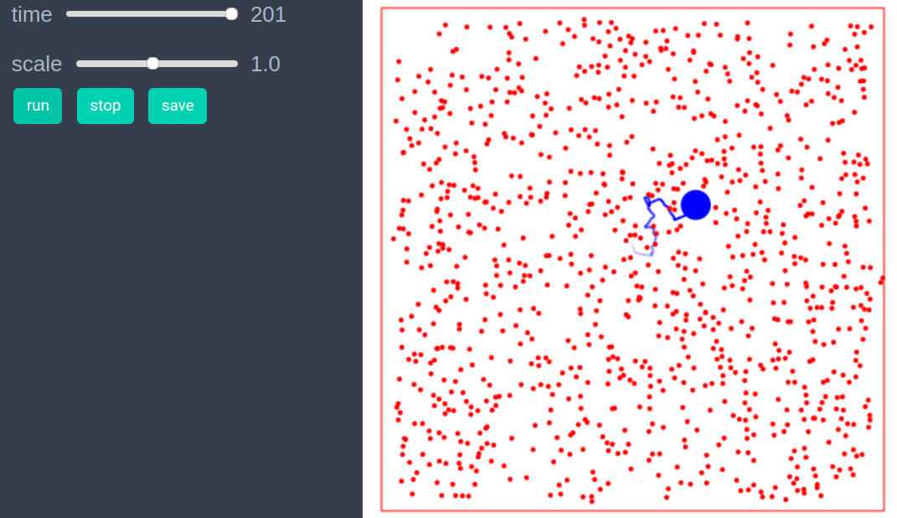

# Brownian Particle

```julia
using EasyABM
```

## Step 1: Create Agents and Model

```julia
balls = con_2d_agents(1000, pos = Vect(0.0,0.0), size = 0.05,mass=1.0,  
keeps_record_of = Set([:pos]))
box = con_2d_agent(pos=Vect(5.0,5.0), shape = :square_line, size = 10.0)
model = create_2d_model([box, balls...], agents_type=Static, space_type = NPeriodic, dw =0.1)
```

## Step 2: Initialise the model


```julia
function initialiser!(model)
    xdim, ydim = model.size
    #medium
    for i in 3:length(model.agents)
        agent=model.agents[i]
        agent.pos = Vect(rand()*xdim, rand()*ydim)
        v = Vect(rand()-0.5, rand()-0.5) 
        agent.vel = v/(veclength(v)+0.001)
        agent.last_pos = agent.pos
    end
    
    #brownian particle
    model.agents[2].size = 0.15 #
    model.agents[2].color = cl"blue"
    model.agents[2].pos = Vect(5.0,5.0)
    model.agents[2].vel = Vect(0.0,0.0)
    model.agents[2].mass = 10.0
    
end


init_model!(model, initialiser=initialiser!)
```

## Step 3: Defining the step_rule! and running the model

```julia

function components(vec1, dir)
    val = dotprod(vec1, dir)
    vec_parl = dir*val
    vec_perp = vec1-vec_parl
    return vec_parl, vec_perp   
end

function transfer_momentum(agent, nbrs)
    for nbr in nbrs
        dir = nbr.pos - agent.pos
        dist = veclength(dir)
        if (nbr.shape == :circle) && (dist < agent.size+nbr.size)
            unit_dir = dir/dist
            mag = (agent.size+nbr.size) - dist
            disp = unit_dir*mag*0.5
            agent.pos -= disp
            nbr.pos += disp
            ag_vel_parl, ag_vel_perp = components(agent.vel, unit_dir)
            nbr_vel_parl, nbr_vel_perp = components(nbr.vel, unit_dir)
            x = nbr.mass/agent.mass
            agent.vel = ag_vel_perp + (2*x*nbr_vel_parl+(1-x)*ag_vel_parl)/(1+x)
            nbr.vel = nbr_vel_perp + (2*ag_vel_parl+(x-1)*nbr_vel_parl)/(1+x)
        end
    end
end

function reflect_from_boundaries(agent,xdim,ydim,dw)
    x,y=agent.pos
    velx, vely = agent.vel
    if (x< dw) && (velx <0)
        velx =-velx
    end
    if (x> xdim - dw) && (velx > 0)
        velx =-velx
    end
    if (y< dw) && (vely <0)
        vely =-vely
    end
    if (y> ydim- dw) && (vely > 0)
        vely =-vely
    end
    agent.vel = Vect(velx, vely)
end

function step_rule!(model)
    xdim, ydim = model.size
    dw = model.parameters.dw
    search_radius = model.agents[2].size # radius of the Brownian particle
    for i in 2:length(model.agents)
        agent=model.agents[i]
        reflect_from_boundaries(agent,xdim, ydim, dw)
        nbrs = neighbors(agent, model, search_radius)
        transfer_momentum(agent, nbrs)
        agent.pos += agent.vel*0.1
    end
end

run_model!(model, steps=200, step_rule = step_rule!)
```
## Step 4: Visualisation 

```julia
animate_sim(model)
```




## References 
1) https://en.wikipedia.org/wiki/Brownian_motion