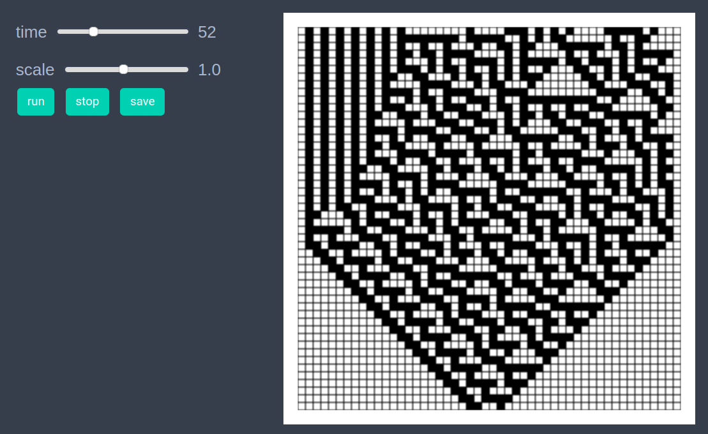
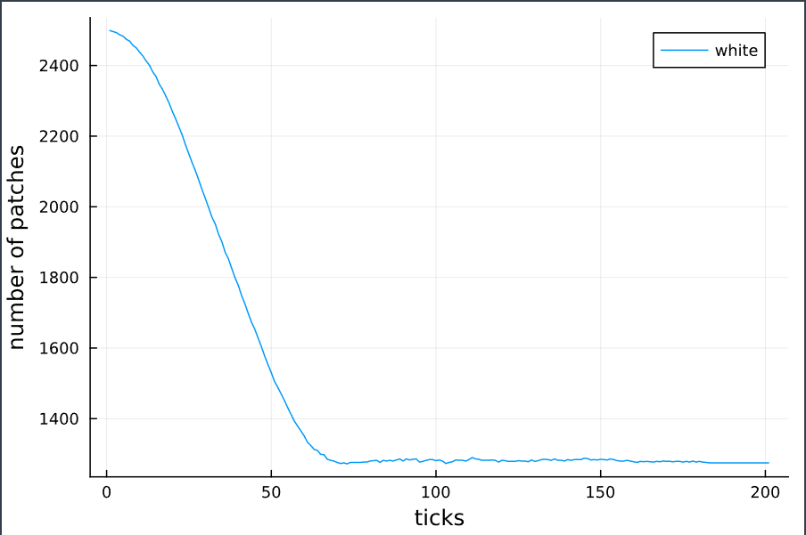

# Elementary cellular automaton

```julia
using EasyABM
```

## Step 1: Create Model

In this model, we work with patches only. We set `grid_size` to (50,50) and set `space_type` to NPeriodic. 


```julia
model = create_2d_model(size = (50,50), space_type=NPeriodic)
```

## Step 2: Initialise the model

We assign two attributes namely `color` and `val` to all patches. The patches with val 0 are white while those with val 1 are black. Initially, we set all patches to have val = 0, color = `cl"white"` except for the patch at position (25,1) which is assigned val = 1, color = `cl"black"`. Since, the `color` and `val` attributes are not independent, we tell EasyABM to record only color attribute of the patches through the argument `props_to_record` to the `init_model!` function. 


```julia
function initialiser!(model)
    for j in 1:model.size[2]
        for i in 1:model.size[1]
            model.patches[i,j].color = cl"white"
            model.patches[i,j].val = 0
        end
    end
    model.patches[25,1].color = cl"black"
    model.patches[25,1].val = 1
end

init_model!(model, initialiser = initialiser!, props_to_record = Dict("patches" => Set([:color])))   
```

## Step 3: Running the model

The dictionary `rules` defines the update rule. It is known as rule number 30 in the classification of elementary cellular automata. The `val` property (and hence the `color`) of jth patch in (i+1)th row is set equal to the value in `rules` corresponding to the key `(a, b, c)` where in the ith row `a` is `val` of (j-1)th patch, `b` is `val` of jth patch and `c` is the `val` of (j+1)th patch. Since the size of our space is finite, after a certain number of iterations we have to copy each row to the row below and update the topmost row.  

```julia
rules = Dict((1,1,1)=>0, (1,1,0)=>0, (1,0,1)=>0, (0,1,1)=>1, 
(1,0,0)=>1, (0,1,0)=>1, (0,0,1)=>1, (0,0,0)=>0) # rule 30


function update_from_row_below(row, model)
    for j in 2:(model.size[1]-1)
        vals = (model.patches[j-1, row-1].val, 
                model.patches[j,   row-1].val, 
                model.patches[j+1, row-1].val)   
        val = rules[vals]
        model.patches[j, row].val = val
        model.patches[j, row].color = val==0 ? cl"white" : cl"black"
    end
end

function copy_to_row_below(row, model)
    for j in 1:model.size[1]
        model.patches[j, row-1].val = model.patches[j, row].val
        model.patches[j, row-1].color = model.patches[j, row].color
    end
end

function step_rule!(model)
    if model.tick < model.size[1]
        row = model.tick+1
        update_from_row_below(row, model)      
    else
        for i in 2:model.size[1]
            copy_to_row_below(i, model)
        end
        update_from_row_below(model.size[1], model)
    end
        
end
```

run_model!(model, steps = 200, step_rule = step_rule!)

## Step 4: Visualisation 

In order to draw the model at a specific frame, say 4th, one can use `draw_frame(model, frame = 4 )`. If one wants to see the animation of the model run, it can be done as 

```julia
animate_sim(model)
```




## Step 5: Fetch Data 

It is easy to fetch any recorded data after running the model. For example, the numbers of patches with color `cl"white"` can be got as follows

```julia
df = get_nums_patches(model, 
    patch-> patch.color == cl"white", 
    labels=["white"], plot_result=true)
```



## References 
https://en.wikipedia.org/wiki/Elementary_cellular_automaton