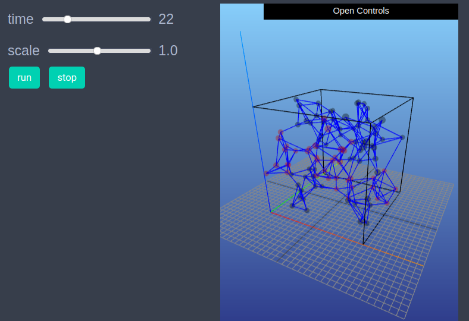
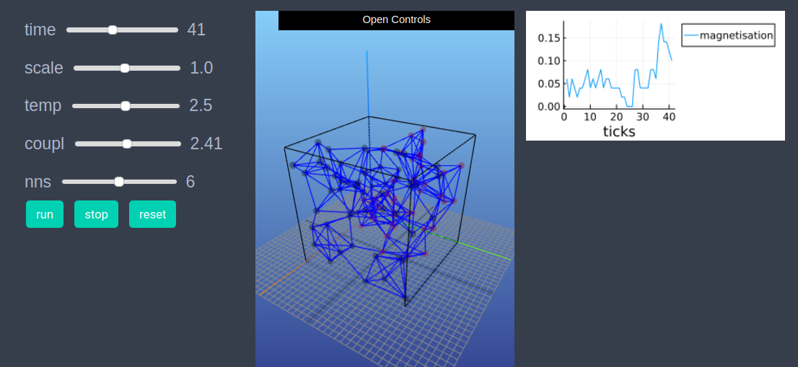

# Ising model on a nearest neighbor random graph 3D
This is another example including Ising model where the underlying graph is a random nearest neighbor graph on plane. 


```julia
using EasyABM
```

## Step 1: Create Model

In this model we will work solely with the graph and won't need agents. We initially create an empty graph, and then create our model as follows. 


```julia
graph = dynamic_simple_graph(0) # in a dynamic graph nodes and edges can be added or deleted. 
model = create_graph_model(graph, temp = 2.0, coupl = 2.5, nns = 5, vis_space="3d")
```

## Step 2: Initialise the model

 In the `initialiser!` function we create a list of n = 100 random points in the plane and fill our graph with n nodes and set the position of ith node to the ith random point. We then link each node to its `nns` number of nearest neighbors and randomly set each node's color to either `cl"black"` or `cl"red"` and set spin value to +1 for `cl"black"` nodes and -1 for `cl"red"` nodes. In the `init_model!` function, the argument `props_to_record` specifies the nodes properties which we want to record during model run. 

 ```julia
using NearestNeighbors
```


```julia
const n=100;
```


```julia
vecs = rand(3, n) .* 10
kdtree = KDTree(vecs,leafsize=1)
    
function initialiser!(model)
    flush_graph!(model) # deletes all nodes and edges
    add_nodes!(n, model, color = cl"black", spin =1) # adds n nodes to model's graph with all the nodes having color black and spin 1
    for i in 1:n 
        model.graph.nodesprops[i].pos3 = (vecs[1,i], vecs[2,i], vecs[3,i]) # set positions of nodes in the 3d space
        indices, _ = knn(kdtree, vecs[:,i], model.parameters.nns, true) # indices of nearest neighboring vectors
        for j in indices
            if j!=i
                create_edge!(i,j, model)
            end
        end
        if rand()<0.5
            model.graph.nodesprops[i].spin = 1
            model.graph.nodesprops[i].color = cl"black"
        else
            model.graph.nodesprops[i].spin = -1
            model.graph.nodesprops[i].color = cl"red"
        end
    end
end
```


```julia
init_model!(model, initialiser= initialiser!, props_to_record = Dict("nodes"=>Set([:color, :spin])))
```


```julia
draw_graph(model.graph)
```

## Step 3: Defining the step_rule! and running the model

In this step we implement the step logic of the Ising model in the `step_rule!` function and run the model for 100 steps. At each step of the simulation we take 100 Monte Carlo steps, where in each Monte Carlo step a node is selected at random and its spin and color values are flipped if the Ising energy condition is satisfied. 


```julia
function step_rule!(model)
    for i in 1:100
        random_node = rand(1:n)
        spin = model.graph.nodesprops[random_node].spin
        nbr_nodes = neighbor_nodes(random_node, model)
        de = 0.0
        for node in nbr_nodes
            nbr_spin = model.graph.nodesprops[node].spin
            de += spin*nbr_spin
        end
        de = 2*model.parameters.coupl * de
        if (de < 0) || (rand() < exp(-de/model.parameters.temp))
            model.graph.nodesprops[random_node].spin = - spin
            model.graph.nodesprops[random_node].color = spin == -1 ? cl"black" : cl"red"
        end
    end
end
```


```julia
run_model!(model, steps = 100, step_rule = step_rule!)
```

## Step 4: Visualisation


In order to draw the model at a specific frame, say 4th, one can use `draw_frame(model, frame = 4)`.  If one wants to see the animation of the model run, it can be done as 

```julia
animate_sim(model)
```



After defining the `step_rule!` function we can also choose to create an interactive application (which currently works in Jupyter with WebIO installation) as shown below. It is recommended to define a fresh model and not initialise it with `init_model!` or run with `run_model!` before creating interactive app. 


```julia
graph = dynamic_simple_graph(0) 

model = create_graph_model(graph, temp = 2.0, coupl = 2.5, nns = 5, vis_space="3d")

create_interactive_app(model, initialiser= initialiser!,
    props_to_record = Dict("nodes"=>Set([:color, :spin])),
    step_rule= step_rule!,
    model_controls=[(:temp, "slider", 0.05:0.05:5.0), 
        (:coupl, "slider", 0.01:0.1:5.0),
        (:nns, "slider", 2:10)],
    node_plots = Dict("magnetisation"=> x -> x.spin),
    frames=100) 
```



## Step 4: Fetch Data 

In this step we fetch the data of average spin of nodes (also called magnetisation) and plot the result as follows.


```julia
df = get_nodes_avg_props(model, node -> node.spin, labels=["magnetisation"], plot_result = true)
```


```julia

```

## References 
1) https://en.wikipedia.org/wiki/Ising_model
