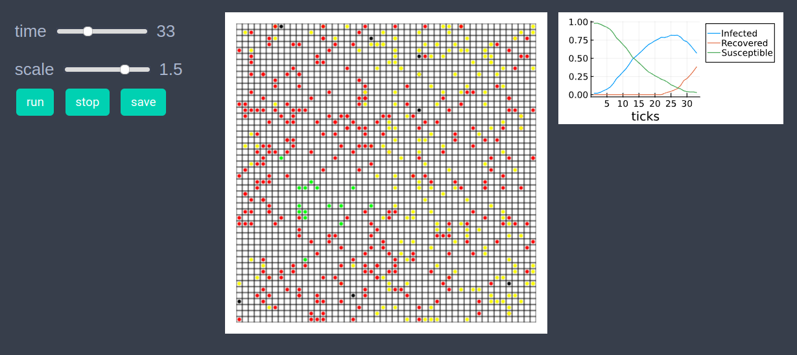
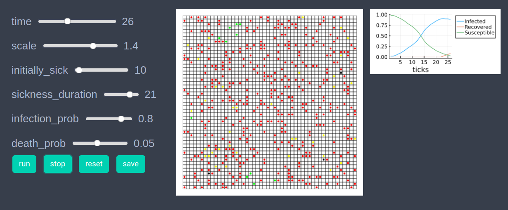

# SIR model

In the agent-based modeling approach an epidemiological model, like SIR model can have a large number of parameters depending upon the requirements. Below we will implement a basic SIR model in EasyABM.

```julia
using EasyABM
```

## Step 1: Create Agents and Model

In our SIR model there will be four type of agents - susceptible, infectious, recovered, dead. We assume that the recovered agents become immune and do not get infected again. We create 500 2d agents all of type agentS (later in the initilisation step will set the type of some agents to be agentI). The `not_well_since` property of an agent is the time since the agent got infected. Our model has parameters `initially_sick` (number of agents initially sick), `sickness_duration` (duration of sickness), `infection_prob` (probability of infection when an infected agent comes in contact with a susceptible agent) and `death_prob` (the probability of death from infection). 

```julia

@enum agentstate begin
    susceptible=1
    infectious=2
    recovered=3
    dead=4
end

agents = grid_2d_agents(500, pos = Vect(1,1), color=cl"green", 
        atype = susceptible, not_well_since = 0, 
        keeps_record_of = Set([:atype, :color, :pos]));

model = create_2d_model(agents, size=(50,50), 
        agents_type = Static, ## agents don't get removed from or added to the model
        space_type = Periodic, initially_sick = 10, 
        sickness_duration = 21, infection_prob = 0.8, 
        death_prob=0.05);
```

## Step 2: Initialise the model

In the second step we initialise the agents by defining `initialiser!` function and sending it as an argument to `init_model!`. In the `initialiser!` function we set first `initially_sick` number of agents to be in infectious state and set their color to `cl"red"`. All other agents are set to be in susceptible state with color `cl"green"`. We also set each agents position at the center of a randomly selected patch.  


```julia
function initialiser!(model)
    for (i,agent) in enumerate(model.agents)
        if i<=model.parameters.initially_sick
            agent.atype = infectious
            agent.color = cl"red"
        else 
            agent.atype = susceptible
            agent.color = cl"green"
        end
        agent.not_well_since = 0 
        x = rand(1:model.size[1])
        y = rand(1:model.size[2])
        agent.pos = Vect(x, y) # center of a random patch
    end
end
init_model!(model, initialiser = initialiser!)
```

## Step 3: Run the model

In this step we implement the step logic of the SIR model in the `step_rule!` function and run the model for 100 steps. 


```julia
function die_or_recover(agent, death_prob)
    if rand()<death_prob
        agent.atype = dead
        agent.color = cl"black"
    else
        agent.atype = recovered
        agent.color = cl"yellow"
    end
    agent.not_well_since = 0 
end

function infect_neighbors(agent, nbrs, infection_prob)
    for nbr in nbrs
        if (nbr.atype ==susceptible) && (rand()< infection_prob)
            nbr.atype = infectious
            nbr.not_well_since = 0
            nbr.color = cl"red"
        end
    end
end

function change_position(agent)
    dx =rand(-1:1)
    dy =rand(-1:1)
    agent.pos += Vect(dx,dy)
end

function step_rule!(model)
    parameters = model.parameters
    for agent in model.agents
        nbrs = grid_neighbors(agent, model, 1) #immediate neighbors on grid
        if agent.atype == infectious
             agent.not_well_since +=1
            if agent.not_well_since > parameters.sickness_duration
                die_or_recover(agent, parameters.death_prob)
            elseif agent.not_well_since>1
                infect_neighbors(agent, nbrs, parameters.infection_prob)
            end   
        end
        if agent.atype !=dead
            change_position(agent)
        end   
    end
end


run_model!(model, steps=100, step_rule = step_rule! )
```

## Step 4: Visualisation

In order to draw the model at a specific frame, say 4th, one can use `draw_frame(model, frame = 4)`. If one wants to see the animation of the model run, it can be done as 

```julia
animate_sim(model, 
agent_plots = Dict(
        "Susceptible"=> ag -> ag.atype == susceptible ? 1 : 0, 
        "Infected" => ag -> ag.atype == infectious ? 1 : 0,
        "Recovered" => ag -> ag.atype == recovered ? 1 : 0
        ),
show_grid=true
)
```




After defining the `step_rule!` function we can also choose to create an interactive application (which currently works in Jupyter with WebIO installation) as 

```julia
create_interactive_app(model, initialiser= initialiser!,
    step_rule= step_rule!,
    model_controls=[(:initially_sick, "slider", 1:500), 
        (:sickness_duration, "slider", 5:25),
        (:infection_prob, "slider", 0.01:0.01:1.0),
        (:death_prob, "slider", 0.01:0.01:0.1)
        ],
    agent_plots = Dict("Susceptible"=> ag -> ag.atype == susceptible ? 1 : 0, 
        "Infected" => ag -> ag.atype == infectious ? 1 : 0,
        "Recovered" => ag -> ag.atype == recovered ? 1 : 0
        ),
    frames=70,
    show_grid=true)   
```




## Step 5: Fetch Data 

The following line of code fetches data of average number of susceptible, infectious and recovered agents. The function `get_agents_avg_props` averages over all agents the values returned by functions sent to it as arguments. 

```julia
df = get_agents_avg_props(model, 
    ag -> ag.atype == susceptible ? 1 : 0,
    ag -> ag.atype == infectious ? 1 : 0, 
    ag -> ag.atype == recovered ? 1 : 0, 
    labels = ["Susceptible", "Infected", "Recovered"],
    plot_result = true
)
```


## References
1.) https://towardsdatascience.com/modelling-a-pandemic-eb94025f248f


    


