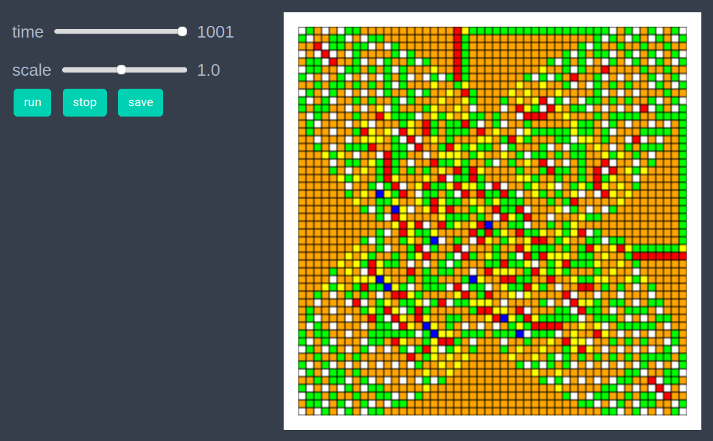
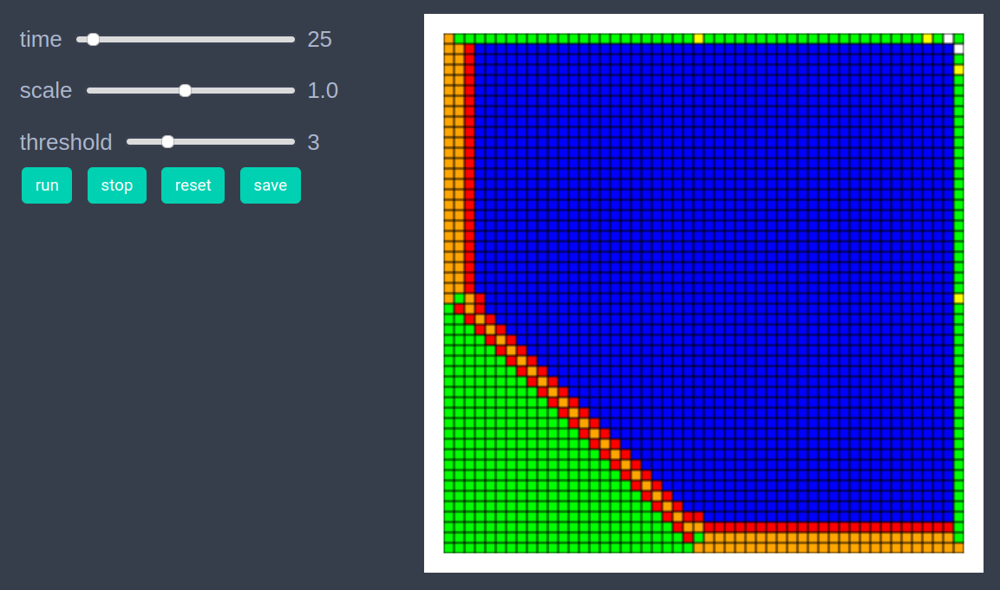
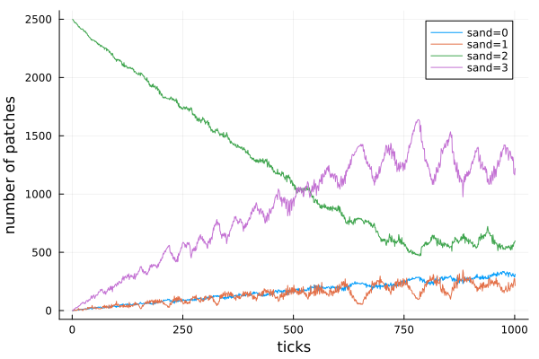

# Abelian Sandpile

```julia
using EasyABM
```

## Step 1: Create Model

In this model, we work with patches only. We set `grid_size` to (50,50), set `space_type` to NPeriodic and define an additional model parameter `threshold` whose value is set to 4. 


```julia
model = create_2d_model(size = (50,50), space_type=NPeriodic, threshold = 4)
```

## Step 2: Initialise the model

Initially, we set the amount of sand on all patches equal to 2 except for the patch (25,25) where we set the sand amount to value 2000. The color attribute of patches is set according to the amount of sand they carry. If the sand amound on a patch is >=4 then its color is blue, otherwise the color is set according to dictionary coldict. 


```julia
const coldict = Dict(0=>cl"white", 1=>cl"yellow", 2=>cl"green", 3=> cl"orange", 4=>cl"red")

function initialiser!(model)
    for j in 1:model.size[2]
        for i in 1:model.size[1]
            if (i,j) != (25,25)
                model.patches[i,j].sand = 2
                model.patches[i,j].color= coldict[2]
            else
                model.patches[i,j].sand = 2000
                model.patches[i,j].color= cl"blue"
            end
        end
    end
end

init_model!(model, initialiser = initialiser!, props_to_record = Dict("patches" => Set([:color,:sand])))
```

## Step 3: Running the model

In the step function we loop over all the patches and if a patch has sand >= 4, we topple that patch which means that i) We reduce the amount of sand on that patch by 4 ii) We increase the amount of sand on its Von Neumann neighboring patches by 1. 

```julia

function topple!(patch_loc, model, threshold)
    nbr_patch_locs = neighbor_patches(patch_loc, model, 1, dist_func=manhattan_distance)
    for p in nbr_patch_locs
        pth_patch = model.patches[p...]
        sand = pth_patch.sand + 1
        pth_patch.sand = sand
        pth_patch.color = sand <= 4 ? coldict[sand] : cl"blue" 
    end
    patch = model.patches[patch_loc...]
    sand = patch.sand-threshold
    patch.sand = sand
    patch.color = sand <= 4 ? coldict[sand] : cl"blue" 
end

function step_rule!(model)
    threshold = model.parameters.threshold
    for j in 1:model.size[2]
        for i in 1:model.size[1]
            if model.patches[i,j].sand>=threshold
                topple!((i,j),model, threshold)
            end
        end
    end
end

run_model!(model, steps = 1000, step_rule = step_rule!)
```
## Step 4: Visualisation 

In order to draw the model at a specific frame, say 4th, one can use `draw_frame(model, frame = 4 )`. If one wants to see the animation of the model run, it can be done as 

```julia
animate_sim(model)
```




After defining the `step_rule!` function we can also choose to create an interactive application (which currently works in Jupyter with WebIO installation) as 

```julia
create_interactive_app(model, initialiser= initialiser!,
    props_to_record = Dict("patches" => Set([:color])),
    model_controls = [(:threshold, "slider", 1:10)],
    step_rule= step_rule!,frames=500, show_grid=true) 
```




## Step 5: Fetch Data 

It is easy to fetch any recorded data after running the model. For example, the numbers of patches with different amounts of sand at all timesteps can be got as follows

```julia
df = get_nums_patches(model, 
    patch-> patch.sand == 0, 
    patch-> patch.sand == 1, 
    patch-> patch.sand == 2, 
    patch-> patch.sand == 3,
    labels=["sand=0","sand=1","sand=2","sand=3"], plot_result=true)
```



## References 
1.) https://en.wikipedia.org/wiki/Abelian_sandpile_model