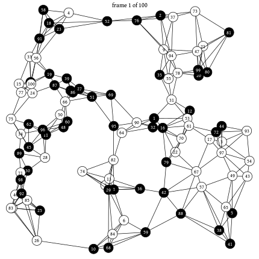

```@meta
CurrentModule = EasyABM
```

!!! warn
    This documentation is for the upcoming version 2.0.0 of EasyABM which has some breaking changes.  
# EasyABM.jl
A lightweight and easy to use framework for agent-based modelling. 

## Package Features
* Intuitive function based approach for all ABM modelling tasks. 
* Support for Heterogeneous agents, where each agent can record its own properties. 
* Grid blocks, called patches, in 2d and 3d models can be assigned properties like agents.
* Nodes and edges in a graph based model can also be assigned properties like agents. 
* Underlying Graph in a graph model can be chosen to be fully dynamic in which edges and nodes can be added or removed during model run.
* Easy to create and save animation.
* Live interactive panel can also be easily created in Jupyter in a few lines of code. 
  
|                                     |                                     |
| ----------------------------------- | ----------------------------------- |
|  |   |


   


