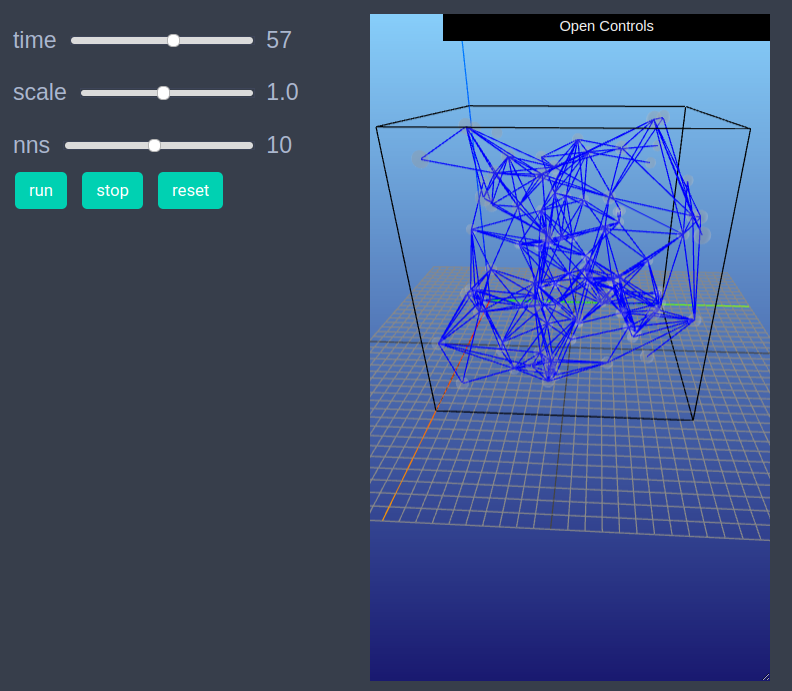

# Nearest neighbor graph generator 3D

We include the present model as an example of dynamic graphs in EasyABM.

```julia
using EasyABM
```

## Step 1: Create Model

In this model we will work solely with the graph and won't require agents. We create a dynamic graph of n=100 vertices (and no edges) and create a model with this graph as base space. The model parameter `nns` is the number of nearest neighbors that each node will have edges with. 

```julia
n=500
graph = dynamic_simple_graph(n);  
model = create_graph_model(graph, nns=10, vis_space="3d")
```

## Step 2: Initialise the model

In this model we use NearestNeighbors.jl package to produce a kdtree of points which will be used to get nearest neighbors in the step rule. We create a random 3xn matrix and initialise the positions of nodes with these vectors. 

```julia
vecs = rand(3, n).* 10; # positions of nodes take values from 0 to 10 on all axes. 

function initialiser!(model)
    for ed in collect(edges(model.graph))
        kill_edge!(ed, model)
    end
    for i in 1:n
        model.graph.nodesprops[i].pos = (vecs[1,i], vecs[2,i], vecs[3,i])
    end
end

init_model!(model, initialiser= initialiser!)
```

## Step 3: Defining the step_rule! and running the model

In the `step_rule!` function we need to compute nearest neighbors of points for which we make use of NearestNeighbors.jl package.


```julia
using NearestNeighbors
kdtree = KDTree(vecs,leafsize=1)

function step_rule!(model)
    if model.tick <=n
        i = model.tick
        indices, _ = knn(kdtree, vecs[:,i], model.parameters.nns, true)
        for j in indices
            if j!=i
                create_edge!(i,j, model)
            end
        end
    end  
end

run_model!(model, steps=n, step_rule = step_rule! )
```

## Step 3: Visualisation

In order to draw the model at a specific frame, say 4th, one can use `draw_frame(model, frame = 4)`. If one wants to see the animation of the model run, it can be done as 

```julia
animate_sim(model)
```


After defining the `step_rule!` function we can also choose to create an interactive application (which currently works in Jupyter with WebIO installation) as shown below. It is recommended to define a fresh model and not initialise it with `init_model!` or run with `run_model!` before creating interactive app. 

```julia
n=500
graph = dynamic_simple_graph(n);  

model = create_graph_model(graph, nns=10, vis_space="3d")

create_interactive_app(model, initialiser = initialiser!,
    step_rule = step_rule!,
    model_controls = [(:nns, "slider", 1:20)],
    frames = n
)
```




## Step 5: Fetch Data 

In the present model we didn't record any data, however, since the model involved a dynamic graph the number of edges (and nodes) at each time step were recorded by default by EasyABM. We can get the data of number of edges at each time step as follows

```julia
df = get_nums_edges(model, edge-> true, labels=["num edges"], plot_result = true)
```


