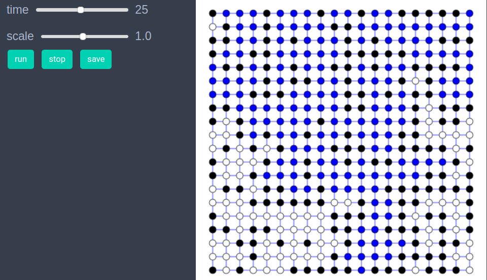

# Percolation on a 2d grid graph


```julia
using EasyABM
```

## Step 1: Create Model

In this model we will work solely with the graph and won't need agents. We initially create a grid graph, and then create our model as follows. 


```julia
graph = square_grid_graph(20,20);
model = create_graph_model(graph, open_nodes=Int[], percolated=false, prob=0.0)
```

## Step 2: Initialise the model

 In the `initialiser!` we make the node at the upper right corner of the grid graph to be open and also give it color `cl"blue"` to indicate presence of water at this node. All other nodes are kept closed and their color is set to `cl"black"`.

```julia
function initialiser!(model)
    model.properties.num_nodes=length(vertices(model.graph))
    for node in vertices(model.graph)
        if node==model.properties.num_nodes
            model.graph.nodesprops[node].open=true
            model.graph.nodesprops[node].color=cl"blue"
        else
            model.graph.nodesprops[node].open=false
            model.graph.nodesprops[node].color=cl"black"
        end   
    end
    push!(model.properties.open_nodes, model.properties.num_nodes) #last node is open & has water
    model.properties.percolated=false
end

init_model!(model, initialiser= initialiser!, props_to_record = Dict("nodes"=>Set([:color])))
```


## Step 3: Defining the step_rule! and running the model

In this step we implement the step logic of the percolation model in the `step_rule!` function and run the model for 50 steps. At each step of the simulation we make 10 randomly chosen nodes `open` and let water flow to them (i.e. assign them blue color) if connected to any source node (i.e. blue colored node). 


```julia
function let_water_out!(node, model)
    water_source_nodes=[node]
    loop_condition = true
    n = model.properties.num_nodes
    while length(water_source_nodes)>0 && loop_condition
        nd = pop!(water_source_nodes)
        nbrs = neighbor_nodes(nd, model)
        for nbr in nbrs
            if (model.graph.nodesprops[nbr].open)&&(model.graph.nodesprops[nbr].color==cl"white")
                model.graph.nodesprops[nbr].color = cl"blue"
                if (nbr<=sqrt(n))
                    model.properties.percolated=true
                    model.properties.prob = length(model.properties.open_nodes)/n
                    loop_condition=false
                    break
                end
                push!(water_source_nodes, nbr)
            end
        end   
    end
end

function let_water_in!(node, model)
    nbrs = neighbor_nodes(node, model)     
    n=model.properties.num_nodes
    for nbr in nbrs
        if model.graph.nodesprops[nbr].open && (model.graph.nodesprops[nbr].color==cl"blue")
            model.graph.nodesprops[node].color = cl"blue"
            if (node<=sqrt(n))
                model.properties.percolated=true
                model.properties.prob = length(model.properties.open_nodes)/n
                return 
            end
            break
        end
    end
end


function step_rule!(model)
    num=0
    n=model.properties.num_nodes
    percolated = model.properties.percolated
    #open 10 nodes per step
    while (num<10) && (length(model.properties.open_nodes)<n) && (!percolated)
        node = rand(1:n)
        if !(model.graph.nodesprops[node].open)
            num+=1
            model.graph.nodesprops[node].open = true
            push!(model.properties.open_nodes, node)
            if (node<=n)&&(node>=(n-sqrt(n)+1))#upper most row
                model.graph.nodesprops[node].color=cl"blue"
            else
                model.graph.nodesprops[node].color=cl"white"
                let_water_in!(node, model)
            end 
            if (model.graph.nodesprops[node].color == cl"blue") && !(model.properties.percolated)
                let_water_out!(node, model)
            end
            percolated = model.properties.percolated      
        end
    end   
end
```


```julia
run_model!(model, steps = 50, step_rule = step_rule!)
```

## Step 4: Visualisation


In order to draw the model at a specific frame, say 4th, one can use `draw_frame(model, frame = 4)`.  If one wants to see the animation of the model run, it can be done as 

```julia
animate_sim(model)
```



The code below calculates the average probability at which percolation occurs for an ensemble of model runs. 


```julia
function calculate_percolation_probability(;grid_graph_size=20, attempts=10)
    n=grid_graph_size
    frames=Int(ceil(n^2/10)) # every step 10 random nodes are opened, so n^2/10 steps must be enough
    percolation_probs = Float64[]
    for _ in 1:attempts
        graph = square_grid_graph(n,n)
        model = create_graph_model(graph, open_nodes=Int[], percolated=false, graphics=false, prob=0.0) 
        init_model!(model, initialiser= initialiser!)
        run_model!(model, steps=frames, step_rule = step_rule! )
        if model.properties.percolated
            push!(percolation_probs, model.properties.prob)
        end
    end
    percolation_probs
end 


probs=calculate_percolation_probability(grid_size=20, attempts=80);
sum(probs)/length(probs)
0.5919687499999999
```

## References 
1) https://en.wikipedia.org/wiki/Percolation_theory
