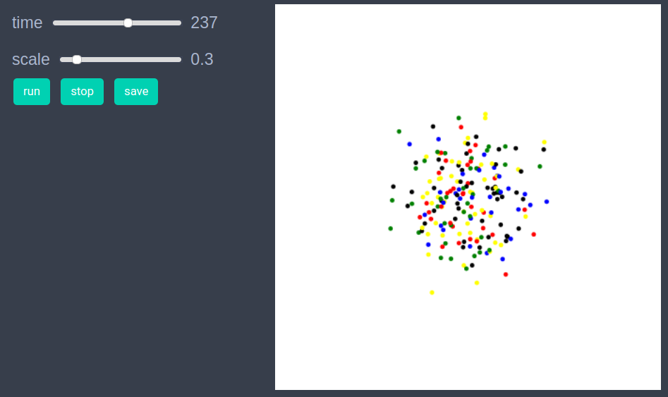

# Random Walkers

A simple example of random walkers in 2D. 


```julia
using EasyABM
```


```julia
agents = con_2d_agents(200, pos = Vect(5.0,5.0), color = cl"red", shape=:circle, keeps_record_of=Set([:pos]))
```


```julia
model = create_2d_model(agents, agents_type = Static, space_type=NPeriodic, dt=0.2)
```


```julia
function initialiser!(model)
    colors = [cl"red", cl"blue", cl"green", cl"yellow", cl"black"]
    for agent in model.agents
        agent.color = colors[rand(1:5)]
    end    
end
init_model!(model, initialiser = initialiser!)
```


```julia
function step_rule!(model)
    for agent in model.agents
        agent.pos += Vect(0.5-rand(), 0.5-rand())*model.properties.dt
    end
end
```


```julia
run_model!(model, steps=400, step_rule=step_rule!)
```


```julia
animate_sim(model)
```


