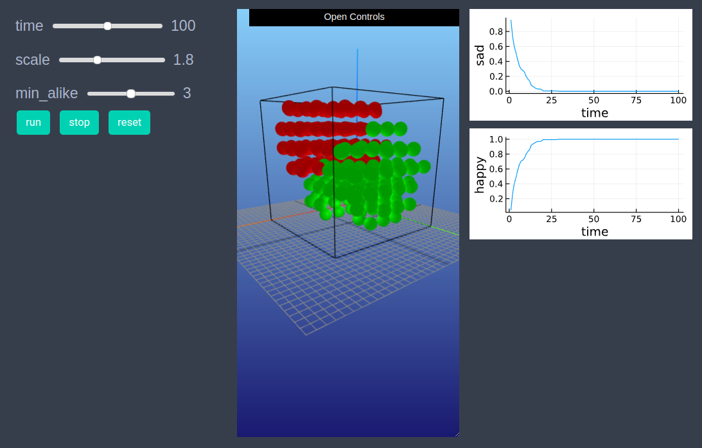
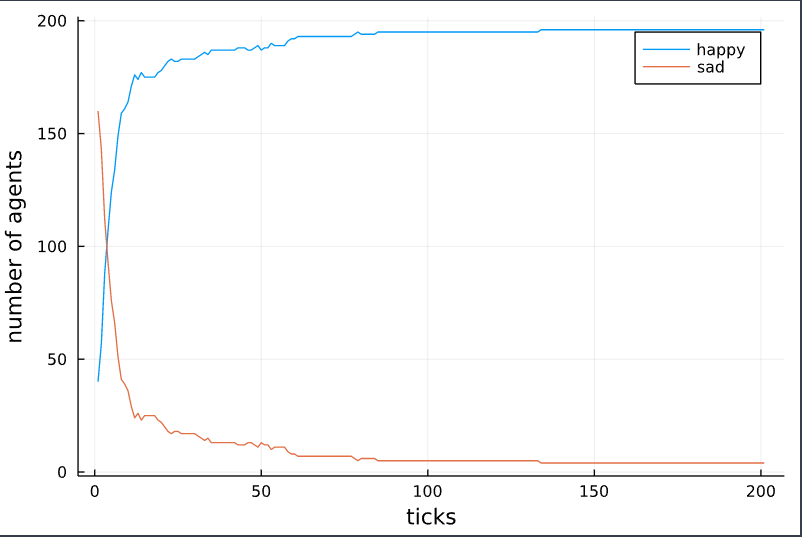

# Schelling segregation model

```julia
using EasyABM
```

## Step 1: Create Agents and Model

Lets create 200 agents with properties `pos`, `mood` and `color`. The `keeps_record_of` argument is list of properties that the agent will record during time evolution. The `min_alike` property of the model which specifies the minimum number of alike neighbors for an agent to be happy, is set to be 8. 

```julia
@enum agentsfeeling happy sad
agents = grid_3d_agents(200, pos = Vect(1,1,1), color = cl"red", mood = happy, keeps_record_of=Set([:pos, :mood]))
model = create_3d_model(agents, agents_type = Static, space_type = NPeriodic, size = (7,7,7), min_alike = 8)
```

## Step 2: Initialise the model

In the second step we initialise the agents by defining `initialiser!` function and then sending it as an argument to `init_model!`. In the `initialiser!` function we randomly set agents color to be either `cl"red"` or `cl"green"` and set their positions randomly such that there is not more than one agent on each patch. Then we set the `mood` property of each agent to be `happy` or `sad` depending upon the number of alike agents in neighborhood. 


```julia
function initialiser!(model)
    for agent in model.agents
        agent.color = [cl"red", cl"green"][rand(1:2)]
        x,y,z = random_empty_patch(model) 
        agent.pos = Vect(x, y, z)     
    end    
    for agent in model.agents
        nbrs = grid_neighbors(agent, model, 1)
        num_same = 0
        for nbr in nbrs
            if nbr.color == agent.color
                num_same += 1
            end
        end
        if num_same < model.parameters.min_alike
            agent.mood = sad
        end
    end
end
init_model!(model, initialiser = initialiser!)
```

## Step 3: Run the model

In this step we implement the step logic of the Schelling's model in the `step_rule!` function and run the model for 200 steps. 


```julia
function step_rule!(model)
    min_alike = model.parameters.min_alike
    for agent in model.agents
        num_alike = 0
        for nbr in grid_neighbors(agent, model,1)
            if agent.color == nbr.color
                num_alike += 1
            end
        end
        if num_alike ≥ min_alike
            agent.mood = happy
        else
            agent.mood = sad
            x,y,z = random_empty_patch(model) 
            agent.pos = Vect(x, y, z)
        end
    end
    return
end

run_model!(model, steps=200, step_rule = step_rule!)
```

## Step 4: Visualisation

The following code will draw the state of the model at frame number 4. 

```julia
draw_frame(model, frame=4)
```

If one wants to see the animation of the model run, it can be done as 

```julia
animate_sim(model)
```


After defining the `step_rule!` function we can also choose to create an interactive application (which currently works in Jupyter with WebIO installation) as 

```julia
create_interactive_app(model, initialiser= initialiser!,
    step_rule=step_rule!,
    model_controls=[(:min_alike, "slider", 1:12)], 
    agent_plots=Dict(
        "happy"=> agent-> agent.mood == happy, 
        "sad"=> agent-> agent.mood == sad),
    frames=200)  

```




## Step 5: Fetch Data 

In this step we fetch data of number of happy and sad agents at each time step as a dataframe with following function. 

```julia
df = get_nums_agents(model, agent-> agent.mood == happy, agent-> agent.mood == sad,labels=["happy","sad"], plot_result=true)
```




Individual agent data recorded during model run can be obtained as 

```julia
df = get_agent_data(model.agents[1], model).record
```
    


