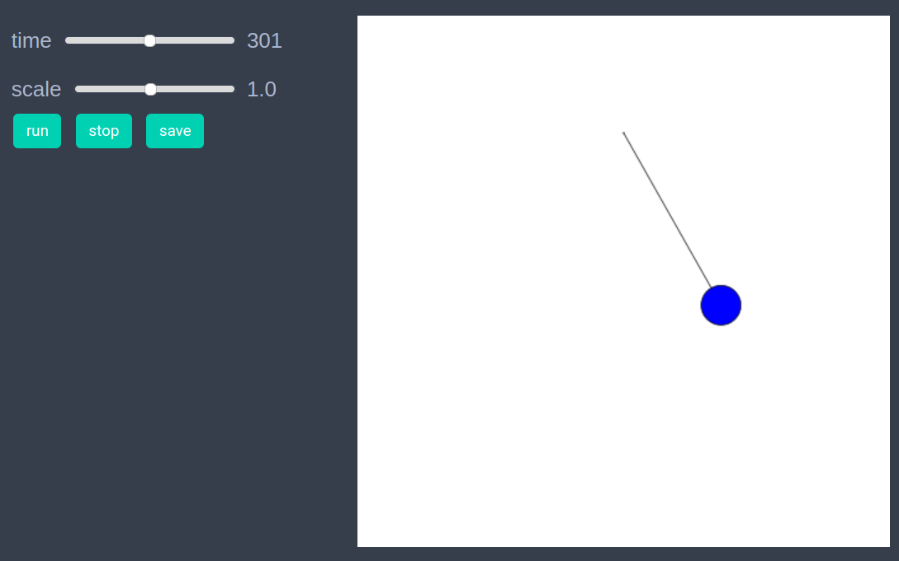
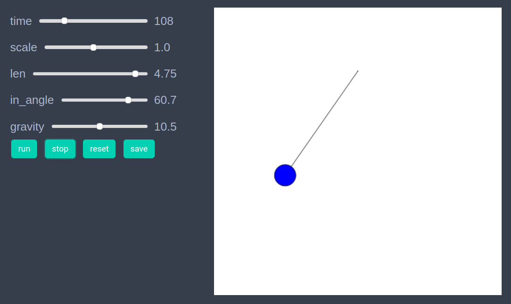

# Simple pendulum 
We will implement simulation of a simple pendulusing using graph space model.  


```julia
using EasyABM
```

## Step 1: Create Model

In this model we will work solely with the graph and won't need agents. We initially create a graph with two nodes, and then create our model with parameters `gravity`, `dt`, `len` and `in_angle` as follows. 


```julia
graph = graph_from_dict(Dict(
    "num_nodes"=>2,
    "edges"=>[(1,2)]
))

model = create_graph_model(gr, gravity = 9.0, dt=0.1, len= 4.0, in_angle=30.0)
```

## Step 2: Initialise the model

In this step set initial values of position, angle and angular velocity. The nodes in a graph can have values of x and y coordinates in range 0 to 10. We set the position of first (fixed) node to be Vect(5, 8) and that of the second node (which represents the hanging mass) at a distance of model.parameters.len and angle (in degrees) of model.parameters.in_angle below the fixed node. 

 ```julia
function initialiser!(model)
    len = model.parameters.len
    theta = model.parameters.in_angle*pi/180
    pos1 = Vect(5.0, 8.0)
    pos2 = pos1 + Vect(len*sin(theta), -len*cos(theta))
    model.graph.nodesprops[1].pos = pos1
    model.graph.nodesprops[1].size = 0.1 # make the peg node invisible
    model.graph.nodesprops[2].pos = pos2
    model.graph.nodesprops[2].ang_vel = 0.0
    model.graph.nodesprops[2].angle = theta
    model.graph.nodesprops[2].color = cl"blue"
end

init_model!(model, initialiser= initialiser!, 
    props_to_record = Dict("nodes"=>Set([:pos]))) 
```

## Step 3: Defining the step_rule! and running the model

In this step we implement the step logic of the simple pendulum and run the model for 500 steps. 

```julia
function step_rule!(model)
    len = model.parameters.len
    dt = model.parameters.dt
    gravity = model.parameters.gravity
    peg = model.graph.nodesprops[1].pos
    model.graph.nodesprops[2].angle += model.graph.nodesprops[2].ang_vel*dt
    theta =  model.graph.nodesprops[2].angle
    model.graph.nodesprops[2].ang_vel += -gravity*sin(theta)*dt/len
    model.graph.nodesprops[2].pos = peg + Vect(len*sin(theta), -len*cos(theta))    
end
```


```julia
run_model!(model, steps = 500, step_rule = step_rule!)
```

## Step 4: Visualisation


If one wants to see the animation of the model run, it can be done as 

```julia
animate_sim(model)
```



After defining the `step_rule!` function we can also choose to create an interactive application (which currently works in Jupyter with WebIO installation) as 


```julia
create_interactive_app(model, initialiser= initialiser!,
    props_to_record = Dict("nodes"=>Set([:pos])),
    step_rule= step_rule!,
    model_controls=[(:len, "slider", 2.0:0.05:5.0), 
        (:in_angle, "slider", 5.0:0.1:75.0),
        (:gravity, "slider", 1.0:0.5:20.0)],
    frames=500) 
```



## Step 4: Fetch Data 

We can fetch the recorded data of the moving node (which is node 2 in our case) as follows

```julia
df = get_node_data(2, model)
```
```julia