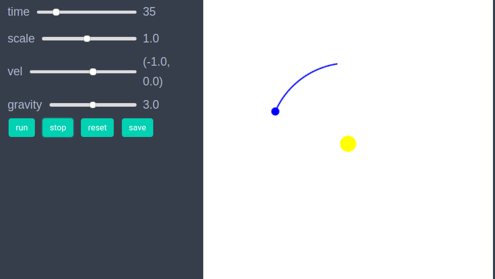

# Tutorial

Studying an agents based model in EasyABM is basically a 4-step process. 

1. Create agents and model. (After creating the model one may also choose to explore the model through an interactive app.) 
2. Initialise the model, through an `initialiser` function.
3. Run the model with a `step_rule` function.
4. Fetch and analyse data collected during model run. (Interactive visualisation based on the data collected during model run can also be easily created).

We explain these steps below through a very simple model of a star-planet system. Though it can be debated if a star-planet system can really qualify as an agent based model, it nevertheless serves as a good example for demonstrating the workings of EasyABM. 

## Step 1: Create the agents and the model.

In the first step we create the agents and the model. For the star-planet system, we need one agent for the star and one for the planet. We will assume that the star is stationary and the planet revolves around it. We set the position of the star to be (5,5) which is the center point of the 2d space, as the default dimensions of 2d space in EasyABM is 10x10. We set the position of the planet to be (7,5) and its velocity to be (0,1). Since, the planet will change its position we require it to record its position during the model run. We specify this via `keeps_record_of` property of the planet. The `gravity` property of the model is a constant of proportionality for the force between the star and the planet. 

```julia
star = create_2d_agent( pos = (5,5), size = 15, color = :yellow) # by default 2d space is 10x10, so that (5,5) is center.
planet = create_2d_agent(pos = (7,5), vel = (0,1), size=5, color = :blue, keeps_record_of = [:pos]) 
model = create_2d_model([star, planet], gravity = 3.0)
```

## Step 2: Initialise the model.

In this step we define an initialiser function to set the initial properties of the agents. Suppose we want our planet to be at position (5,8) and velocity (-1, 0) initially. We can do so by defining an initialiser function and then sending it as an argument to `init_model!` function as follows.

```julia
function initialiser!(model)
    function initialiser!(model)
    planet = model.agents[2]
    planet.pos = (5, 8)
    planet.vel = (-1,0)
end

init_model!(model, initialiser = initialiser!)
```

## Step 3: Define a `step_rule` and run the model

In this step, we define rule for the time evolution and then run the model. We define our `step_rule` to be simply discretisation of Newton's equations for 2 body system.

```julia
function step_rule!(model)
    gravity = model.parameters.gravity
    star = model.agents[1]
    planet = model.agents[2]
    distance_vector = (star.pos - planet.pos)
    distance = norm(distance_vector)
    force = gravity*distance_vector/distance^3
    planet.vel += force
    planet.pos+= planet.vel  
end
```
Now we can run the model for desired number of steps as follows

```julia
run_model!(model, steps = 200)
```

Once the model has run, we can look at the animation of the time evolutio with following line of code

```julia
animate_sim(model)
```


Once the model has been run it can be saved to the disk as a jld2 file using following function.

```julia
save_model(model, model_name = "sun_planet_model", save_as = "sun_planet.jld2", folder = "/path/to/folder/")
```

A model saved previously as jld2 file, can be fetched as follows 

```julia
model = open_saved_model(model_name = "sun_planet_model", path = "/path/to/folder/sun_planet.jld2")
```

Instead of first running the model, we can create an interactive app in Jupyter to explore the model by setting different valies of parameters, as shown below. Here, the `model_control` argument is for creating a slider with values from 1 to 5 in steps of 0.2 for the model parameter `gravity`. The agent_controls argument creates a slider for the x component of planet's initial velocity. The tail argument attaches a tail of length 30 with the planet by selecting it with its color property which we previously set to :blue. 

```julia
create_interactive_app(model, initialiser= initialiser!,
    step_rule= step_rule!,
    model_controls=[(:gravity, :s, 1:0.2:5.0)], 
    agent_controls=[(:vel, :s, [(x, 0.0) for x in -10.0:0.1:5])],
    frames=200, tail = (30, agent -> agent.color == :blue)) 
```




## Step 4: Fetch data

In this simple model, the only data we have collected is the position of the planet. We can get this data as follows. 

```julia
df = get_agent_data(model.agents[2], model).record
```


